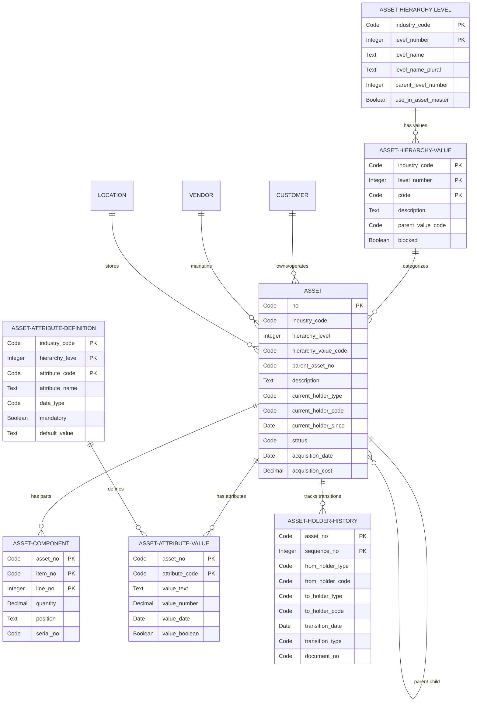

# Asset Pro - Analysis and Planning Document

**Project:** Asset Pro - Multi-Industry Asset Management for Business Central
**Publisher:** JEMEL
**Date:** 2025-11-04
**Status:** Analysis Phase - Planning for Implementation
**Workflow Mode:** Analysis (Relaxed)

---

## Executive Summary

Asset Pro is a universal asset management solution for Microsoft Dynamics 365 Business Central that adapts to any industry. Unlike specialized solutions (marine, construction, medical), Asset Pro provides a **configurable platform** that transforms based on industry needs while maintaining a single codebase.

### Vision Statement
> "Track any asset, any industry, your way"

### Market Opportunity
- **Target Market:** Multi-industry asset-intensive businesses using Business Central
- **Competitive Positioning:** $49-89/user/month vs. competitors at $99-149/user/month
- **Unique Value:** Single platform that feels native to each industry through configurable terminology and hierarchies

### Key Innovation: Unlimited Hierarchical Levels
Unlike traditional asset management (2 levels: Asset → Parts), Asset Pro supports **unlimited configurable hierarchy levels** with industry-specific terminology:

**Example - Vehicles Industry:**
```
Fleet (Root)
  └─ Vehicle Type (Level 1)
      └─ Vehicle Model (Level 2)
          └─ Vehicle Unit (Level 3: Specific asset)
              └─ Components (Level 4+)
```

**Example - Medical Equipment:**
```
Hospital (Root)
  └─ Department (Level 1)
      └─ Equipment Category (Level 2)
          └─ Device (Level 3: Specific asset)
```

### Core Architecture
Based on proven patterns from Rollsberg Fleet Management (80% reusable), generalized for universal applicability:

1. **Flexible Hierarchy System** - Unlimited levels with configurable terminology
2. **Asset Master Records** - Self-referential parent/child relationships
3. **Component Management** - Any asset can contain other assets
4. **Attribute Framework** - Industry-specific custom fields without code
5. **Ownership Tracking** - Multiple owner/holder types with transition history
6. **Deep BC Integration** - Native integration with Sales, Purchasing, Transfers

---

## Requirements Analysis

### 1. Functional Requirements

#### 1.1 Unlimited Asset Hierarchy (MUST) - Priority: Critical

**Business Need:**
Different industries have different organizational structures. Construction companies think "Fleet → Equipment Type → Model," while hospitals think "Hospital → Department → Equipment Category → Device."

**Requirement:**
- Define industry-specific hierarchy structure at setup time
- Each level has configurable name and code
- Assets link to: a) root level (industry), b) any level in hierarchy
- Support minimum 3 levels, maximum 10 levels
- Prevent circular references
- Validate parent-child level compatibility

**Technical Approach:**
```
Table: Asset Hierarchy Level Definition
- Industry Code (root identifier)
- Level Number (1, 2, 3...)
- Level Name (e.g., "Vehicle Type", "Department")
- Level Name Plural (e.g., "Vehicle Types", "Departments")
- Parent Level Number

Table: Asset Hierarchy Value
- Industry Code
- Level Number
- Code (unique within level)
- Description
- Parent Value Code (link to parent level)
```

**User Experience:**
- Setup wizard defines hierarchy levels and terminology
- UI pages dynamically show level-appropriate terminology
- Drilldowns follow hierarchy structure naturally
- Use CaptionClass for dynamic field renaming (like Dimensions)

**Validation Rules:**
- Cannot assign asset to incompatible hierarchy level
- Cannot delete hierarchy level if values exist
- Cannot create circular parent-child references
- Parent must exist before assigning children

**Example Configuration:**

*Vehicles Industry:*
```
Level 1: Vehicle Type (Truck, Van, Car)
  Level 2: Vehicle Model (F-150, Transit, Camry)
    Level 3: Vehicle Unit (specific VIN)
```

*Medical Equipment:*
```
Level 1: Department (Radiology, Surgery, ICU)
  Level 2: Equipment Category (Imaging, Monitoring, Surgical)
    Level 3: Device (specific serial number)
```

#### 1.2 Asset Attributes per Hierarchy Level (SHOULD) - Priority: High

**Business Need:**
Different asset types need different data fields. MRI machines need "Tesla Rating" field, excavators need "Max Load Capacity," servers need "CPU Cores."

**Requirement:**
- Define custom attributes per industry and hierarchy level
- Support data types: Text, Number, Date, Option, Boolean, Lookup
- Attributes inherited down hierarchy (configurable)
- Mandatory/optional per attribute
- Default values supported

**Technical Approach:**
```
Table: Asset Attribute Definition
- Industry Code
- Hierarchy Level (0 = all levels)
- Attribute Code
- Attribute Name
- Data Type
- Option String (for Option type)
- Mandatory Flag
- Default Value
- Inherited from Parent Flag

Table: Asset Attribute Value
- Asset No.
- Attribute Code
- Value (Text/Number/Date/Boolean)
```

**Implementation:**
- Use FactBox for attribute display/edit
- Validation on data type constraints
- Lookup integration for reference data
- Report builder includes custom attributes

**Examples:**

*Construction Equipment:*
- Max Load Capacity (Decimal)
- Fuel Type (Option: Diesel, Electric, Hybrid)
- Operational Hours (Decimal)
- Last Inspection Date (Date)

*Medical Equipment:*
- FDA Approval No. (Text)
- Device Classification (Option: Class I, II, III)
- Sterilization Method (Option: Autoclave, EtO, Gamma)
- Patient Capacity (Integer)

#### 1.3 Self-Referential Asset Parent/Child (MUST) - Priority: Critical

**Business Need:**
Assets have components which are themselves assets. Examples:
- Vehicle → Engine (asset) → Turbocharger (asset)
- Building → HVAC System (asset) → Compressor (asset)
- Production Line → Machine (asset) → Control Unit (asset)

**Requirement:**
- Single Asset table with Parent Asset No. field
- Any asset can be parent to other assets
- Support multiple levels of nesting
- Prevent circular references
- Component table separate for non-asset parts
- Hierarchy level compatibility validation

**Technical Approach:**
```
Table: Asset
- No. (PK)
- Parent Asset No. (FK to Asset)
- Hierarchy Industry Code
- Hierarchy Level Number
- Component Type Code (if component)

Table: Asset Component (non-asset parts)
- Asset No. (FK)
- Item No. (FK to Item table)
- Quantity
- Position/Location
- Serial No.
```

**Validation Rules:**
- Parent asset hierarchy level must be above child level
- Cannot assign asset as its own parent
- Cannot create circular reference chain
- Component assets must be assigned to valid parent

**Use Cases:**
```
Scenario 1: Vehicle with engine as asset
- Vehicle (Asset A1, Level 3: Vehicle Unit)
  └─ Engine (Asset A2, Level 4: Component, Parent = A1)
      └─ Turbocharger (Asset A3, Level 5: Sub-component, Parent = A2)

Scenario 2: Building with systems
- Building (Asset B1, Level 2: Facility)
  └─ HVAC System (Asset B2, Level 3: Building System, Parent = B1)
  └─ Electrical System (Asset B3, Level 3: Building System, Parent = B1)
```

**Circular Reference Prevention:**
```al
procedure ValidateParentAsset(ParentNo: Code[20]) {
    CheckAssetNo: Code[20];
    Depth: Integer;

    CheckAssetNo := ParentNo;
    Depth := 0;

    while (CheckAssetNo <> '') and (Depth < 100) do begin
        if CheckAssetNo = Rec."No." then
            Error('Circular reference detected');

        if AssetRec.Get(CheckAssetNo) then
            CheckAssetNo := AssetRec."Parent Asset No."
        else
            CheckAssetNo := '';

        Depth += 1;
    end;
}
```

#### 1.4 Current Owner/Holder Tracking (MUST) - Priority: Critical

**Business Need:**
Assets move between locations, customers, cost centers, vendors. Need to track current holder and full transition history.

**Requirement:**
- Current holder can be: Customer, Vendor, Location, Cost Center
- Track holder type and holder code
- Maintain transition history (from-to audit trail)
- Support multiple holder roles (Owner, Operator, Lessee, Maintainer)
- Date-stamped transitions

**Technical Approach:**
```
Table: Asset
- Current Holder Type (Enum: Customer, Vendor, Location, Cost Center)
- Current Holder Code (Code[20])
- Current Holder Since (Date)
- Owner Customer No.
- Operator Customer No.
- Lessee Customer No.

Table: Asset Holder History
- Asset No.
- Sequence No.
- From Holder Type
- From Holder Code
- To Holder Type
- To Holder Code
- Transition Date
- Transition Type (Sale, Transfer, Lease, Service, Return)
- Document No. (link to BC document)
- Reason Code
```

**Holder Types:**
- **Customer** - End user, lessee, buyer
- **Vendor** - Maintenance provider, storage facility
- **Location** - Warehouse/site in BC Location table
- **Cost Center** - Internal department (via Dimension)

**Transition Types:**
- Manual Transfer - Admin moves asset
- Sales Order - Asset sold to customer
- Purchase Order - Asset acquired from vendor
- Transfer Order - Asset moved between locations
- Service Order - Asset sent for maintenance
- Lease Agreement - Asset leased to customer

**Validation:**
- Holder Code must exist in respective table
- Cannot transition to same holder
- Document reference validated if provided

#### 1.5 BC Document Integration (MUST) - Phase 2 Priority

**Business Need:**
Asset transitions must follow standard Business Central processes for audit trail, approval, and financial posting.

**Requirement:**
- Transfer Orders - Move assets between locations
- Sales Orders - Sell assets to customers
- Purchase Orders - Acquire assets from vendors
- Service Orders - Send assets for maintenance (future)
- Automatic holder transition on posting

**Technical Approach:**
```
Table Extension: Sales Header
- Asset No. (link to Asset)
- Asset Transition Type (Sale, Lease)

Table Extension: Sales Line
- Asset No. (inherited from header)
- Asset Component No. (optional)

Table Extension: Transfer Header
- Asset No. List (multiple assets per transfer)

Event Subscriber: OnAfterSalesPostComplete
- Update Asset.Current Holder = Customer
- Create Asset Holder History record
- Set Transition Date = Posting Date

Event Subscriber: OnAfterTransferPostComplete
- Update Asset.Current Holder = To-Location
- Create Asset Holder History record
```

**Phase 2 Implementation:**
- Design in Phase 1 (table structures)
- Implement in Phase 2 (event subscribers)
- Test in Phase 3 (integration testing)

---

### 2. Non-Functional Requirements

#### 2.1 Performance
- Hierarchy navigation: < 100ms for 10,000 assets
- Attribute loading: < 50ms per asset
- Parent-child validation: < 200ms
- Circular reference check: Max depth 100, timeout 1 second

#### 2.2 Scalability
- Support 100,000+ assets
- Support 1,000+ hierarchy levels (10 levels × 100 values)
- Support 50+ custom attributes per industry
- Support 10+ industries in single tenant

#### 2.3 Usability
- Setup wizard completes in < 10 minutes
- Terminology adapts automatically (no manual caption changes)
- Hierarchy navigation intuitive (drill-down/up)
- Mobile-friendly pages (responsive design)

#### 2.4 Security
- Role-based access per industry
- Field-level security for sensitive attributes
- Audit trail for all transitions
- Data classification compliance

#### 2.5 Maintainability
- Single codebase for all industries
- No hard-coded terminology
- Configuration-driven behavior
- Automated testing for core functions

---

## Proposed Architecture

### 1. Data Model Architecture

#### 1.1 Core Entity Model



#### 1.2 Hierarchy Navigation Pattern

**Challenge:** Users need to drill down through hierarchy levels intuitively.

**Solution:** Cascading list pages with dynamic captions

```
Page: Industry List (Root)
  └─ Action: Show [Level 1 Name Plural]
      └─ Page: Level 1 Value List (filtered)
          └─ Action: Show [Level 2 Name Plural]
              └─ Page: Level 2 Value List (filtered)
                  └─ Action: Show Assets
                      └─ Page: Asset List (filtered to this hierarchy)
```

**Implementation:**
- Use page variables to pass hierarchy context
- Filter asset list by industry + hierarchy path
- Dynamic page captions via CaptionClass
- Breadcrumb navigation in FactBox

#### 1.3 Asset Parent-Child Pattern

**Self-referential relationship with level validation:**

```al
table 70182301 "JML Asset"
{
    field(1; "No."; Code[20]) { }
    field(10; "Parent Asset No."; Code[20])
    {
        TableRelation = "JML Asset" where("Industry Code" = field("Industry Code"));

        trigger OnValidate()
        begin
            ValidateParentAssetCompatibility;
            CheckCircularReference;
        end;
    }

    procedure ValidateParentAssetCompatibility()
    var
        ParentAsset: Record "JML Asset";
    begin
        if "Parent Asset No." = '' then
            exit;

        if not ParentAsset.Get("Parent Asset No.") then
            Error('Parent asset %1 does not exist.', "Parent Asset No.");

        if ParentAsset."Hierarchy Level" >= "Hierarchy Level" then
            Error('Parent asset must be at a higher hierarchy level.');

        if ParentAsset."Industry Code" <> "Industry Code" then
            Error('Parent asset must be in the same industry.');
    end;

    procedure CheckCircularReference()
    var
        CheckAsset: Record "JML Asset";
        CurrentAssetNo: Code[20];
        Depth: Integer;
    begin
        CurrentAssetNo := "Parent Asset No.";
        Depth := 0;

        while (CurrentAssetNo <> '') and (Depth < 100) do begin
            if CurrentAssetNo = "No." then
                Error('Cannot create circular reference.');

            if CheckAsset.Get(CurrentAssetNo) then
                CurrentAssetNo := CheckAsset."Parent Asset No."
            else
                CurrentAssetNo := '';

            Depth += 1;
        end;

        if Depth >= 100 then
            Error('Maximum parent-child depth exceeded.');
    end;
}
```

### 2. Business Logic Layer

#### 2.1 Core Management Codeunit

```al
codeunit 70182301 "JML Asset Management"
{
    // Asset lifecycle operations
    procedure CreateAsset(IndustryCode: Code[20]; HierarchyLevel: Integer; Description: Text[100]): Code[20]
    procedure CopyAssetWithChildren(SourceAssetNo: Code[20]; NewDescription: Text[100]): Code[20]
    procedure TransferAssetOwnership(AssetNo: Code[20]; NewHolderType: Enum "JML Asset Holder Type"; NewHolderCode: Code[20]; TransitionType: Enum "JML Asset Transition Type"; DocumentNo: Code[20])
    procedure GetAssetChildren(ParentAssetNo: Code[20]; var TempAssetBuffer: Record "JML Asset" temporary)
    procedure GetAssetHierarchyPath(AssetNo: Code[20]): Text[250]

    // Hierarchy operations
    procedure ValidateHierarchySetup(IndustryCode: Code[20]): Boolean
    procedure GetHierarchyLevelName(IndustryCode: Code[20]; LevelNumber: Integer): Text[50]
    procedure GetHierarchyLevelNamePlural(IndustryCode: Code[20]; LevelNumber: Integer): Text[50]

    // Attribute operations
    procedure SetAssetAttribute(AssetNo: Code[20]; AttributeCode: Code[20]; Value: Text[250])
    procedure GetAssetAttribute(AssetNo: Code[20]; AttributeCode: Code[20]): Text[250]
    procedure ValidateMandatoryAttributes(AssetNo: Code[20]): Boolean
}
```

#### 2.2 Setup Wizard Codeunit

```al
codeunit 70182302 "JML Asset Setup Wizard"
{
    procedure RunSetupWizard()
    var
        SetupWizardPage: Page "JML Asset Setup Wizard";
    begin
        SetupWizardPage.RunModal;
    end;

    procedure CreateIndustryTemplate(IndustryCode: Code[20]; IndustryName: Text[50]; TemplateType: Enum "JML Industry Template Type")
    // Create default hierarchy levels based on template

    procedure ApplyVehiclesTemplate(IndustryCode: Code[20])
    begin
        CreateHierarchyLevel(IndustryCode, 1, 'Vehicle Type', 'Vehicle Types');
        CreateHierarchyLevel(IndustryCode, 2, 'Vehicle Model', 'Vehicle Models');
        CreateHierarchyLevel(IndustryCode, 3, 'Vehicle Unit', 'Vehicle Units');

        CreateAttribute(IndustryCode, 3, 'VIN', 'VIN Number', "Data Type"::Text, true);
        CreateAttribute(IndustryCode, 3, 'YEAR', 'Year', "Data Type"::Integer, true);
        CreateAttribute(IndustryCode, 3, 'MILEAGE', 'Mileage', "Data Type"::Decimal, false);
    end;

    procedure ApplyMedicalTemplate(IndustryCode: Code[20])
    begin
        CreateHierarchyLevel(IndustryCode, 1, 'Department', 'Departments');
        CreateHierarchyLevel(IndustryCode, 2, 'Equipment Category', 'Equipment Categories');
        CreateHierarchyLevel(IndustryCode, 3, 'Device', 'Devices');

        CreateAttribute(IndustryCode, 3, 'FDA', 'FDA Approval No.', "Data Type"::Text, true);
        CreateAttribute(IndustryCode, 3, 'CLASS', 'Device Class', "Data Type"::Option, true);
        CreateAttribute(IndustryCode, 3, 'STERIL', 'Sterilization Method', "Data Type"::Option, false);
    end;
}
```

### 3. User Interface Layer

#### 3.1 Dynamic Page Captions Using CaptionClass

Business Central's CaptionClass mechanism allows dynamic field renaming without code modification.

**Setup Table:**
```al
table 70182300 "JML Asset Setup"
{
    field(100; "Hierarchy L1 Caption"; Text[50]) { }
    field(101; "Hierarchy L1 Caption Plural"; Text[50]) { }
    field(110; "Hierarchy L2 Caption"; Text[50]) { }
    field(111; "Hierarchy L2 Caption Plural"; Text[50]) { }
    field(120; "Hierarchy L3 Caption"; Text[50]) { }
    field(121; "Hierarchy L3 Caption Plural"; Text[50]) { }
}
```

**CaptionClass Codeunit:**
```al
codeunit 70182310 "JML Asset Caption Mgmt."
{
    [EventSubscriber(ObjectType::Codeunit, Codeunit::"Caption Class", 'OnResolveCaptionClass', '', true, true)]
    local procedure OnResolveCaptionClass(CaptionArea: Text; CaptionExpr: Text; Language: Integer; var Caption: Text; var Resolved: Boolean)
    var
        AssetSetup: Record "JML Asset Setup";
    begin
        if CaptionArea <> 'JML' then
            exit;

        AssetSetup.Get();

        case CaptionExpr of
            'H1': Caption := AssetSetup."Hierarchy L1 Caption";
            'H1P': Caption := AssetSetup."Hierarchy L1 Caption Plural";
            'H2': Caption := AssetSetup."Hierarchy L2 Caption";
            'H2P': Caption := AssetSetup."Hierarchy L2 Caption Plural";
            'H3': Caption := AssetSetup."Hierarchy L3 Caption";
            'H3P': Caption := AssetSetup."Hierarchy L3 Caption Plural";
        end;

        Resolved := true;
    end;
}
```

**Asset Page with Dynamic Captions:**
```al
page 70182301 "JML Asset Card"
{
    field("Hierarchy Level 1"; Rec."Hierarchy Level 1 Code")
    {
        CaptionClass = 'JML,H1';  // Resolves to "Vehicle Type" or "Department"
        ApplicationArea = All;
    }

    field("Hierarchy Level 2"; Rec."Hierarchy Level 2 Code")
    {
        CaptionClass = 'JML,H2';  // Resolves to "Vehicle Model" or "Equipment Category"
        ApplicationArea = All;
    }
}
```

**Result:**
- Vehicles industry: Shows "Vehicle Type", "Vehicle Model"
- Medical industry: Shows "Department", "Equipment Category"
- **No code changes required** - driven by setup data

---

## Object Inventory

### Production Objects (ID Range: 70182300-70182449)

#### Tables (70182300-70182329)

| ID | Object Name | Purpose | Priority |
|----|-------------|---------|----------|
| 70182300 | JML Asset Setup | Company-wide configuration | Phase 1 |
| 70182301 | JML Asset | Main asset master record | Phase 1 |
| 70182302 | JML Asset Hierarchy Level | Define hierarchy structure | Phase 1 |
| 70182303 | JML Asset Hierarchy Value | Hierarchy classification values | Phase 1 |
| 70182304 | JML Asset Attribute Definition | Custom attribute definitions | Phase 1 |
| 70182305 | JML Asset Attribute Value | Asset attribute values | Phase 1 |
| 70182306 | JML Asset Holder History | Ownership transition audit trail | Phase 1 |
| 70182307 | JML Asset Component | Non-asset parts/items list | Phase 1 |
| 70182308 | JML Asset Comment Line | Comments for assets | Phase 1 |
| 70182309 | JML Industry Template | Pre-built industry templates | Phase 2 |
| 70182310 | JML Asset Status | Status code setup | Phase 2 |
| 70182311 | JML Transition Type | Transition type setup | Phase 2 |

#### Pages (70182330-70182379)

| ID | Object Name | Type | Purpose | Priority |
|----|-------------|------|---------|----------|
| 70182330 | JML Asset Setup Card | Card | Configuration page | Phase 1 |
| 70182331 | JML Asset Setup Wizard | Navigate | Initial setup wizard | Phase 1 |
| 70182332 | JML Asset List | List | Main asset list | Phase 1 |
| 70182333 | JML Asset Card | Card | Asset details | Phase 1 |
| 70182334 | JML Hierarchy Level List | List | Hierarchy setup | Phase 1 |
| 70182335 | JML Hierarchy Value List | List | Hierarchy values | Phase 1 |
| 70182336 | JML Hierarchy Value Card | Card | Hierarchy value details | Phase 1 |
| 70182337 | JML Attribute Definition List | List | Attribute setup | Phase 1 |
| 70182338 | JML Asset Attributes FactBox | FactBox | Show attributes | Phase 1 |
| 70182339 | JML Asset Holder History | List | Transition history | Phase 1 |
| 70182340 | JML Asset Component Subpage | ListPart | Asset parts list | Phase 1 |
| 70182341 | JML Asset Tree | List | Hierarchical view | Phase 2 |
| 70182342 | JML Industry Template List | List | Template selection | Phase 2 |
| 70182343 | JML Asset FactBox | FactBox | Asset summary | Phase 2 |
| 70182344 | JML Holder History FactBox | FactBox | Recent transitions | Phase 2 |

#### Codeunits (70182380-70182399)

| ID | Object Name | Purpose | Priority |
|----|-------------|---------|----------|
| 70182380 | JML Asset Management | Core asset operations | Phase 1 |
| 70182381 | JML Asset Setup Wizard | Setup wizard logic | Phase 1 |
| 70182382 | JML Asset Caption Mgmt. | Dynamic caption resolution | Phase 1 |
| 70182383 | JML Hierarchy Management | Hierarchy operations | Phase 1 |
| 70182384 | JML Asset Attribute Mgmt. | Attribute operations | Phase 1 |
| 70182385 | JML Asset Transfer | Ownership transfer logic | Phase 1 |
| 70182386 | JML Asset Copy | Copy asset with children | Phase 2 |
| 70182387 | JML Asset Validation | Business rule validation | Phase 2 |
| 70182388 | JML Document Integration | BC document event handlers | Phase 2 |

#### Enums (70182400-70182409)

| ID | Object Name | Values | Priority |
|----|-------------|--------|----------|
| 70182400 | JML Asset Holder Type | Customer, Vendor, Location, Cost Center | Phase 1 |
| 70182401 | JML Asset Transition Type | Sale, Transfer, Lease, Service, Return | Phase 1 |
| 70182402 | JML Asset Status | Active, Inactive, Maintenance, Decommissioned | Phase 1 |
| 70182403 | JML Attribute Data Type | Text, Integer, Decimal, Date, Boolean, Option | Phase 1 |
| 70182404 | JML Industry Template Type | Vehicles, Medical, Construction, IT, Custom | Phase 1 |
| 70182405 | JML Asset Component Type | Asset, Item, Virtual | Phase 2 |

#### Reports (70182410-70182419)

| ID | Object Name | Purpose | Priority |
|----|-------------|---------|----------|
| 70182410 | JML Asset List | Asset inventory report | Phase 2 |
| 70182411 | JML Asset Hierarchy | Hierarchy structure report | Phase 2 |
| 70182412 | JML Asset Transitions | Holder history report | Phase 2 |
| 70182413 | JML Asset by Holder | Assets grouped by current holder | Phase 2 |

#### Table Extensions (70182420-70182429)

| ID | Object Name | Extends | Purpose | Priority |
|----|-------------|---------|---------|----------|
| 70182420 | JML Customer Ext | Customer | Asset count FlowFields | Phase 2 |
| 70182421 | JML Vendor Ext | Vendor | Maintained asset count | Phase 2 |
| 70182422 | JML Location Ext | Location | Asset count at location | Phase 2 |
| 70182423 | JML Sales Header Ext | Sales Header | Asset context fields | Phase 2 |
| 70182424 | JML Sales Line Ext | Sales Line | Asset/component reference | Phase 2 |

#### Page Extensions (70182430-70182439)

| ID | Object Name | Extends | Purpose | Priority |
|----|-------------|---------|---------|----------|
| 70182430 | JML Customer Card Ext | Customer Card | Asset FactBox | Phase 3 |
| 70182431 | JML Vendor Card Ext | Vendor Card | Asset FactBox | Phase 3 |
| 70182432 | JML Location Card Ext | Location Card | Asset FactBox | Phase 3 |
| 70182433 | JML Sales Order Ext | Sales Order | Asset fields | Phase 3 |

### Test Objects (ID Range: 50100-50199)

#### Test Codeunits (50100-50149: Unit Tests)

| ID | Object Name | Purpose |
|----|-------------|---------|
| 50100 | JML Asset Setup Tests | Test setup wizard |
| 50101 | JML Hierarchy Tests | Test hierarchy validation |
| 50102 | JML Asset Creation Tests | Test asset creation |
| 50103 | JML Circular Reference Tests | Test circular ref prevention |
| 50104 | JML Attribute Tests | Test attribute management |
| 50105 | JML Asset Transfer Tests | Test ownership transfers |

#### Test Codeunits (50150-50179: Integration Tests)

| ID | Object Name | Purpose |
|----|-------------|---------|
| 50150 | JML Asset Workflow Tests | End-to-end workflows |
| 50151 | JML Document Integration Tests | BC document integration |
| 50152 | JML Multi-Industry Tests | Multiple industries |

#### Test Library (50180-50189)

| ID | Object Name | Purpose |
|----|-------------|---------|
| 50180 | JML Asset Test Library | Test data creation |

---

## Implementation Phases

### Phase 1: Foundation (Weeks 1-4)

**Objective:** Core data model and basic hierarchy management

#### Week 1: Setup & Configuration
- **Tables:**
  - 70182300: JML Asset Setup
  - 70182302: JML Asset Hierarchy Level
  - 70182303: JML Asset Hierarchy Value

- **Pages:**
  - 70182330: JML Asset Setup Card
  - 70182334: JML Hierarchy Level List
  - 70182335: JML Hierarchy Value List

- **Codeunits:**
  - 70182381: JML Asset Setup Wizard
  - 70182383: JML Hierarchy Management

- **Enums:**
  - 70182404: JML Industry Template Type

**Deliverables:**
- User can define industry with up to 10 hierarchy levels
- Hierarchy levels have configurable names
- Setup wizard creates sample hierarchy
- Validation prevents orphaned hierarchy values

**Tests:**
- 50100: Test setup wizard creates valid hierarchy
- 50101: Test hierarchy level validation
- 50101: Test cannot delete level with values

#### Week 2: Asset Master Table
- **Tables:**
  - 70182301: JML Asset
  - 70182308: JML Asset Comment Line

- **Pages:**
  - 70182332: JML Asset List
  - 70182333: JML Asset Card

- **Codeunits:**
  - 70182380: JML Asset Management
  - 70182382: JML Asset Caption Mgmt.

- **Enums:**
  - 70182400: JML Asset Holder Type
  - 70182402: JML Asset Status

**Deliverables:**
- Asset master table with self-referential parent
- Circular reference prevention
- Hierarchy level validation for parent-child
- Dynamic page captions based on industry
- Asset list filtered by hierarchy

**Tests:**
- 50102: Test asset creation
- 50103: Test circular reference prevention
- 50103: Test parent-child level validation
- 50102: Test hierarchy filtering

#### Week 3: Attributes Framework
- **Tables:**
  - 70182304: JML Asset Attribute Definition
  - 70182305: JML Asset Attribute Value

- **Pages:**
  - 70182337: JML Attribute Definition List
  - 70182338: JML Asset Attributes FactBox

- **Codeunits:**
  - 70182384: JML Asset Attribute Mgmt.

- **Enums:**
  - 70182403: JML Attribute Data Type

**Deliverables:**
- Define custom attributes per hierarchy level
- Support Text, Integer, Decimal, Date, Boolean, Option types
- Mandatory attribute validation
- Default values applied on asset creation
- FactBox shows/edits attributes dynamically

**Tests:**
- 50104: Test attribute definition
- 50104: Test mandatory attribute validation
- 50104: Test attribute data type validation
- 50104: Test default value application

#### Week 4: Ownership & Transitions
- **Tables:**
  - 70182306: JML Asset Holder History
  - 70182311: JML Transition Type

- **Pages:**
  - 70182339: JML Asset Holder History

- **Codeunits:**
  - 70182385: JML Asset Transfer

- **Enums:**
  - 70182401: JML Asset Transition Type

**Deliverables:**
- Track current holder (Customer, Vendor, Location, Cost Center)
- Audit trail of all transitions
- Manual transfer procedure
- Holder history visible on asset card
- Validation prevents invalid holder codes

**Tests:**
- 50105: Test holder type validation
- 50105: Test transition history creation
- 50105: Test manual transfer
- 50105: Test holder code validation

**Phase 1 Exit Criteria:**
- All tables compile with 0 errors, 0 warnings
- All pages render correctly
- Setup wizard creates valid industry with 3 levels
- Can create asset, assign to hierarchy, add attributes
- Can transfer asset ownership manually
- All Phase 1 tests pass (50100-50105)
- Code review completed

---

### Phase 2: Advanced Features (Weeks 5-8)

**Objective:** Components, templates, reporting, and document integration

#### Week 5: Asset Components & BOM
- **Tables:**
  - 70182307: JML Asset Component

- **Pages:**
  - 70182340: JML Asset Component Subpage
  - 70182341: JML Asset Tree (hierarchical view)

- **Codeunits:**
  - 70182386: JML Asset Copy

- **Enums:**
  - 70182405: JML Asset Component Type

**Deliverables:**
- Asset can have child assets (component type)
- Asset can have Item references (parts)
- Tree view shows asset + all children
- Copy asset procedure duplicates children
- Component position/location tracking

**Tests:**
- Test asset with child assets
- Test component hierarchy display
- Test copy asset with children
- Test mixed asset/item components

#### Week 6: Industry Templates
- **Tables:**
  - 70182309: JML Industry Template
  - 70182310: JML Asset Status

- **Pages:**
  - 70182331: JML Asset Setup Wizard (enhanced)
  - 70182342: JML Industry Template List

- **Codeunits:**
  - 70182381: JML Asset Setup Wizard (enhanced)

**Deliverables:**
- Pre-built templates: Vehicles, Medical, Construction, IT
- Template includes: hierarchy levels, attributes, defaults
- Setup wizard offers template selection
- One-click apply template
- Custom template creation

**Tests:**
- Test Vehicles template application
- Test Medical template application
- Test custom template creation
- Test template validation

#### Week 7: Reporting
- **Reports:**
  - 70182410: JML Asset List
  - 70182411: JML Asset Hierarchy
  - 70182412: JML Asset Transitions
  - 70182413: JML Asset by Holder

**Deliverables:**
- Asset inventory report (grouping, filtering)
- Hierarchy structure report
- Transition history report
- Assets by current holder report
- Excel export for all reports

**Tests:**
- Test report data accuracy
- Test report filtering
- Test Excel export

#### Week 8: Document Integration (Design)
- **Table Extensions:**
  - 70182423: JML Sales Header Ext
  - 70182424: JML Sales Line Ext

- **Codeunits:**
  - 70182388: JML Document Integration

**Deliverables:**
- Sales Order: Asset No. field
- On post: Update asset holder to customer
- Transfer Order: Asset No. list field
- On post: Update asset location
- Event subscriber framework
- Integration tests for posting

**Tests:**
- 50151: Test sales order asset transfer
- 50151: Test transfer order location update
- 50151: Test holder history creation on posting

**Phase 2 Exit Criteria:**
- Asset components working correctly
- Industry templates functional
- All reports generate correct data
- Document integration framework in place
- All Phase 2 tests pass (50150-50151)
- User acceptance testing completed

---

### Phase 3: Polish & Extensions (Weeks 9-12)

**Objective:** UI enhancements, BC extensions, performance optimization

#### Week 9: FactBoxes & UI Polish
- **Pages:**
  - 70182343: JML Asset FactBox
  - 70182344: JML Holder History FactBox
  - Enhanced all existing pages

**Deliverables:**
- Asset summary FactBox
- Recent transitions FactBox
- Improved page layouts
- Field grouping and visibility
- Mobile-responsive design

#### Week 10: Customer/Vendor/Location Extensions
- **Table Extensions:**
  - 70182420: JML Customer Ext
  - 70182421: JML Vendor Ext
  - 70182422: JML Location Ext

- **Page Extensions:**
  - 70182430: JML Customer Card Ext
  - 70182431: JML Vendor Card Ext
  - 70182432: JML Location Card Ext

**Deliverables:**
- Customer Card shows owned/operated assets
- Vendor Card shows maintained assets
- Location Card shows assets at location
- FlowField counts for all relationships
- FactBoxes on all cards

#### Week 11: Performance Optimization
- **Activities:**
  - Index optimization
  - Query performance tuning
  - Circular reference check optimization
  - Attribute loading optimization

**Deliverables:**
- Hierarchy navigation < 100ms
- Asset card load < 200ms
- Search optimization for 100K+ assets
- Batch operations for bulk updates

#### Week 12: Documentation & Testing
- **Activities:**
  - User documentation
  - Technical documentation
  - Integration test suite
  - Performance testing
  - Security testing

**Deliverables:**
- User manual (setup, daily use, reporting)
- Technical documentation (architecture, extensibility)
- Complete test suite (50100-50199)
- Performance benchmarks
- Security audit

**Phase 3 Exit Criteria:**
- All FactBoxes functional
- Customer/Vendor/Location extensions complete
- Performance meets requirements
- 100% test coverage for critical paths
- Documentation complete
- Ready for production deployment

---

### Phase 4: Future Enhancements (Post-Launch)

**Potential Future Features:**

1. **Service Management Integration**
   - Link assets to Service Items
   - Automatic service order creation
   - Maintenance scheduling
   - Service history tracking

2. **Mobile Application**
   - Mobile-friendly pages
   - Barcode/QR code scanning
   - Photo capture for asset documentation
   - Offline mode

3. **Advanced Analytics**
   - Power BI integration
   - Asset utilization dashboards
   - Predictive maintenance alerts
   - ROI analysis

4. **API & Integration**
   - RESTful API for external systems
   - IoT device integration
   - GPS tracking integration
   - Third-party maintenance systems

5. **Advanced Workflows**
   - Approval workflows for transfers
   - Automated notifications
   - Scheduled reports
   - Alerts for warranty expiration

6. **Financial Integration**
   - Fixed Assets integration
   - Depreciation tracking
   - Insurance value management
   - Cost center allocation

---

## Risks and Mitigation

### 1. Technical Risks

#### Risk: Dynamic Caption Complexity
**Impact:** High
**Probability:** Medium
**Description:** CaptionClass mechanism may not handle all UI scenarios (list pages, reports, etc.)

**Mitigation:**
- Prototype caption management in Week 2
- Create fallback strategy (static captions per industry)
- Test all page types (List, Card, FactBox, Report)
- Document limitations early

**Contingency:**
- If CaptionClass insufficient, use per-industry page variants
- Generate pages from templates during setup
- Accept some manual caption management

---

#### Risk: Circular Reference Performance
**Impact:** Medium
**Probability:** Low
**Description:** Circular reference checking with 100-level depth could timeout on large datasets

**Mitigation:**
- Limit max depth to 20 levels (reasonable for any business)
- Cache parent chain during validation
- Use iterative algorithm (not recursive)
- Add timeout protection (1 second max)

**Contingency:**
- Reduce max depth to 10 levels
- Implement async validation for batch operations
- Add database-level constraint (trigger)

---

#### Risk: Attribute Scalability
**Impact:** High
**Probability:** Medium
**Description:** 50+ attributes per asset could slow page load and search

**Mitigation:**
- Use FactBox for attributes (lazy load)
- Index Attribute Value table properly
- Cache frequently accessed attributes
- Limit attribute display count (show top 10, "more" button)

**Contingency:**
- Reduce max attributes to 20 per asset type
- Implement attribute groups/tabs
- Use separate page for attribute management

---

### 2. Business Risks

#### Risk: User Adoption Resistance
**Impact:** High
**Probability:** Medium
**Description:** Users may find unlimited hierarchy too complex compared to simple 2-level systems

**Mitigation:**
- Setup wizard with templates (quick start)
- Start simple (3 levels) with option to expand
- Video tutorials for setup
- Hands-on training sessions
- Default to "essentials mode" hiding complexity

**Contingency:**
- Offer "simple mode" preset (2-level hierarchy, no attributes)
- Provide consulting services for setup
- Create industry-specific onboarding packages

---

#### Risk: Competitive Response
**Impact:** Medium
**Probability:** High
**Description:** Dynaway or competitors may add multi-industry support

**Mitigation:**
- Move fast (12-week development + launch)
- Patent/trademark unique features (unlimited hierarchy config)
- Build strong customer relationships
- Focus on superior user experience

**Contingency:**
- Compete on price ($49 vs. $99)
- Emphasize superior hierarchy flexibility
- Bundle with implementation services
- Partner with industry associations

---

### 3. Integration Risks

#### Risk: BC Version Compatibility
**Impact:** High
**Probability:** Low
**Description:** Future BC versions may break event subscribers or table extensions

**Mitigation:**
- Use only stable BC APIs
- Avoid deprecated features
- Implement comprehensive integration tests
- Monitor BC release notes
- Test on preview versions

**Contingency:**
- Maintain version-specific branches
- Offer rapid hotfix releases
- Provide migration tools for breaking changes

---

#### Risk: Document Integration Complexity
**Impact:** Medium
**Probability:** Medium
**Description:** Sales/Transfer/Purchase posting may not trigger events reliably

**Mitigation:**
- Test all document types thoroughly
- Use multiple event subscriber points
- Implement validation before posting
- Provide manual correction tools

**Contingency:**
- Offer manual holder update procedure
- Implement batch reconciliation
- Provide audit report for mismatches

---

### 4. Project Delivery Risks

#### Risk: Scope Creep
**Impact:** High
**Probability:** High
**Description:** Customers may request features beyond core plan

**Mitigation:**
- Lock scope for Phases 1-3
- Maintain feature backlog for Phase 4
- Clear communication: "post-launch enhancement"
- Offer customization as paid service

**Contingency:**
- Extend timeline if critical feature discovered
- Negotiate reduced scope in other areas
- Release as v1.1 instead of v1.0

---

#### Risk: Resource Availability
**Impact:** High
**Probability:** Medium
**Description:** Developers may be pulled to other projects

**Mitigation:**
- Dedicate 2-3 developers full-time
- Cross-train team members
- Document architecture continuously
- Use pair programming for critical components

**Contingency:**
- Extend timeline
- Reduce Phase 3 scope
- Hire contractor for specific components

---

### 5. Data Migration Risks

#### Risk: Rollsberg Customer Migration
**Impact:** High
**Probability:** Medium
**Description:** Existing Rollsberg vessel data may not map cleanly to new model

**Mitigation:**
- Build migration codeunit in Phase 2
- Test migration with Rollsberg data
- Provide data mapping wizard
- Offer parallel run period (30 days)

**Contingency:**
- Maintain compatibility layer for Rollsberg objects
- Offer manual data migration service
- Extend transition period

---

## Next Steps

### Immediate Actions (This Week)

1. **Stakeholder Review** - Present this document to project sponsor for approval
2. **Team Assignment** - Assign 2-3 developers to project full-time
3. **Environment Setup** - Provision development BC container
4. **Symbol Extraction** - Run `.claude/Extract-All-Dependencies.ps1` if not done
5. **Kickoff Meeting** - Review architecture with development team

### Week 1 Actions

1. **Create Project Structure**
   - Create AL/src folders for Tables, Pages, Codeunits, Enums
   - Create Test/src folder structure
   - Set up version control branching strategy

2. **Begin Phase 1 Development**
   - Start with 70182300 (Setup table)
   - Implement setup wizard page
   - Create first hierarchy level table

3. **Establish Development Process**
   - Daily standups
   - Code review protocol
   - Testing requirements (AAA pattern)
   - Documentation standards

### Decision Points

**Before Starting Implementation:**

1. **Approve Architecture** ✓/✗
   - Is unlimited hierarchy approach acceptable?
   - Is CaptionClass strategy viable?
   - Are object ID ranges sufficient?

2. **Approve Timeline** ✓/✗
   - Is 12-week timeline realistic?
   - Are phases correctly prioritized?
   - Is Phase 4 scope deferred appropriately?

3. **Approve Resource Plan** ✓/✗
   - Are 2-3 developers sufficient?
   - Is skill mix appropriate?
   - Are support resources identified?

4. **Approve Budget** ✓/✗
   - Development costs (personnel)
   - Testing environment costs
   - Marketing/launch costs
   - Support infrastructure costs

**Sign-off Required:**
- [ ] Technical Lead: ___________________ Date: _______
- [ ] Project Sponsor: ___________________ Date: _______
- [ ] Product Owner: ____________________ Date: _______

---

## Appendices

### Appendix A: Object ID Allocation Detail

**Production Range: 70182300-70182449 (150 objects)**

**Allocation:**
- Tables: 70182300-70182329 (30 objects, 11 assigned, 19 reserved)
- Pages: 70182330-70182379 (50 objects, 15 assigned, 35 reserved)
- Codeunits: 70182380-70182399 (20 objects, 9 assigned, 11 reserved)
- Enums: 70182400-70182409 (10 objects, 6 assigned, 4 reserved)
- Reports: 70182410-70182419 (10 objects, 4 assigned, 6 reserved)
- Table Extensions: 70182420-70182429 (10 objects, 5 assigned, 5 reserved)
- Page Extensions: 70182430-70182439 (10 objects, 4 assigned, 6 reserved)
- Reserved: 70182440-70182449 (10 objects, future use)

**Test Range: 50100-50199 (100 objects)**

**Allocation:**
- Unit Tests: 50100-50149 (50 objects, 6 assigned)
- Integration Tests: 50150-50179 (30 objects, 2 assigned)
- Test Library: 50180-50189 (10 objects, 1 assigned)
- Reserved: 50190-50199 (10 objects)

### Appendix B: Industry Template Specifications

#### Vehicles Industry Template
**Hierarchy:**
- Level 1: Vehicle Type (Truck, Van, Car, SUV)
- Level 2: Vehicle Model (F-150, Transit, Camry)
- Level 3: Vehicle Unit (specific VIN)

**Attributes:**
- VIN (Text, Mandatory)
- Year (Integer, Mandatory)
- Make (Text, Mandatory)
- Model (Text, Mandatory)
- Color (Option, Optional)
- Mileage (Decimal, Optional)
- License Plate (Text, Optional)
- Fuel Type (Option: Gas, Diesel, Electric, Hybrid)
- Transmission (Option: Manual, Automatic)

**Holder Types:** Customer (Owner), Customer (Lessee), Location (Parking)

---

#### Medical Equipment Template
**Hierarchy:**
- Level 1: Department (Radiology, Surgery, ICU)
- Level 2: Equipment Category (Imaging, Monitoring, Surgical)
- Level 3: Device (specific serial number)

**Attributes:**
- FDA Approval No. (Text, Mandatory)
- Device Class (Option: I, II, III, Mandatory)
- Manufacturer (Text, Mandatory)
- Model (Text, Mandatory)
- Serial No. (Text, Mandatory)
- Sterilization Method (Option: Autoclave, EtO, Gamma, Optional)
- Biocompatible (Boolean, Mandatory)
- Warranty Expiry (Date, Optional)
- Last Calibration (Date, Optional)

**Holder Types:** Customer (Hospital), Cost Center (Department), Vendor (Service Provider)

---

#### Construction Equipment Template
**Hierarchy:**
- Level 1: Equipment Category (Earthmoving, Material Handling, Concrete)
- Level 2: Equipment Type (Excavator, Loader, Crane)
- Level 3: Equipment Unit (specific serial)

**Attributes:**
- Serial No. (Text, Mandatory)
- Year (Integer, Mandatory)
- Make (Text, Mandatory)
- Model (Text, Mandatory)
- Max Load Capacity (Decimal, Mandatory)
- Operational Hours (Decimal, Optional)
- Fuel Type (Option: Diesel, Electric, Hybrid)
- Last Inspection Date (Date, Optional)
- Certification No. (Text, Optional)

**Holder Types:** Customer (Owner), Customer (Lessee), Location (Job Site), Vendor (Maintenance)

---

#### IT Infrastructure Template
**Hierarchy:**
- Level 1: Location (Data Center 1, Data Center 2)
- Level 2: Equipment Type (Server, Storage, Network)
- Level 3: Device (specific asset tag)

**Attributes:**
- Asset Tag (Text, Mandatory)
- Serial No. (Text, Mandatory)
- Manufacturer (Text, Mandatory)
- Model (Text, Mandatory)
- CPU Cores (Integer, Optional)
- RAM GB (Decimal, Optional)
- Storage TB (Decimal, Optional)
- OS Version (Text, Optional)
- IP Address (Text, Optional)
- Warranty Expiry (Date, Optional)

**Holder Types:** Cost Center (Department), Location (Data Center), Vendor (Service Provider)

---

### Appendix C: Validation Rules Summary

**Hierarchy Validation:**
1. Level number must be sequential (1, 2, 3..., no gaps)
2. Parent level must exist before child level
3. Cannot delete level with existing values
4. Cannot change level number if values exist
5. Level name must be unique within industry
6. Maximum 10 levels per industry

**Asset Validation:**
1. Asset No. must be unique
2. Industry Code must exist
3. Hierarchy Level must exist in industry
4. Hierarchy Value Code must exist at that level
5. Parent Asset must exist if specified
6. Parent Asset must be at higher level than child
7. Parent Asset must be in same industry
8. Cannot create circular reference (checked up to 100 levels)
9. Current Holder Code must exist in respective table

**Attribute Validation:**
1. Attribute Code must be unique within industry/level
2. Data Type must be valid enum value
3. Option String required for Option data type
4. Default Value must match Data Type
5. Mandatory attributes must have value on asset
6. Value must match defined Data Type

**Holder Transition Validation:**
1. To-Holder must be different from From-Holder
2. Holder Code must exist in respective table
3. Transition Date cannot be in future
4. Document No. must exist if specified
5. Cannot transition to same holder type + code

---

### Appendix D: Performance Targets

**Response Time Targets:**
- Page load (Asset Card): < 500ms
- Page load (Asset List, 1000 records): < 1 second
- Hierarchy navigation (drill-down): < 100ms
- Attribute FactBox load: < 50ms
- Circular reference check: < 200ms
- Search (100K assets): < 2 seconds
- Report generation (1000 assets): < 5 seconds

**Scalability Targets:**
- Support 100,000+ assets
- Support 10+ industries per tenant
- Support 1,000+ hierarchy values per industry
- Support 50+ attributes per asset type
- Support 10,000+ holder transitions per day

**Concurrency Targets:**
- Support 50 concurrent users
- Asset creation: 100 assets/minute
- Holder transitions: 500 transitions/minute
- Report execution: 10 concurrent reports

---

### Appendix E: Security & Compliance

**Data Classification:**
- Asset No.: CustomerContent
- Description: CustomerContent
- Serial No.: CustomerContent
- Attribute Values: CustomerContent (default)
- Holder History: CustomerContent
- Comments: CustomerContent

**Permission Sets:**
- **JML ASSET ADMIN** - Full access to setup and all assets
- **JML ASSET MANAGER** - Create/modify assets, no setup access
- **JML ASSET VIEWER** - Read-only access to assets
- **JML ASSET HOLDER** - Update holder information only

**Field-Level Security:**
- Acquisition Cost: Restricted to Finance users
- Attribute Values: Configurable per attribute
- Holder transitions: Audit log protected

**Audit Requirements:**
- Log all holder transitions (automated)
- Log attribute changes (future enhancement)
- Log setup changes (future enhancement)
- Retain audit logs for 7 years (configurable)

---

### Appendix F: Testing Strategy

**Unit Test Coverage:**
- Setup wizard: 100%
- Hierarchy validation: 100%
- Asset creation: 100%
- Circular reference check: 100%
- Attribute management: 100%
- Holder transitions: 100%

**Integration Test Scenarios:**
- Multi-level asset hierarchy creation
- Cross-industry asset management
- Document integration (Sales, Transfer, Purchase)
- Performance testing (100K assets)
- Concurrent user testing (50 users)

**User Acceptance Testing:**
- Setup wizard walkthrough
- Daily asset management workflows
- Reporting and analysis
- Mobile responsiveness
- Accessibility compliance

**Performance Testing:**
- Load testing (100K assets)
- Stress testing (concurrent users)
- Endurance testing (24-hour run)
- Spike testing (sudden load increase)

---

## Document Control

**Version History:**

| Version | Date | Author | Changes |
|---------|------|--------|---------|
| 1.0 | 2025-11-04 | Claude | Initial comprehensive analysis and planning document |

**Approval Status:** DRAFT - Awaiting Stakeholder Review

**Next Review Date:** 2025-11-11 (1 week)

---

**End of Document**
