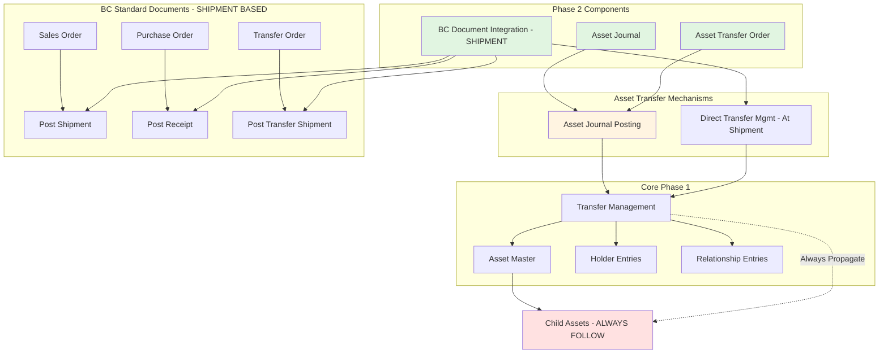

# Asset Pro - Phase 2 Analysis and Planning Document (v2 - ADJUSTED)

**Project:** Asset Pro - Multi-Industry Asset Management for Business Central
**Phase:** Phase 2 - Asset Transfer and Document Integration
**Publisher:** JEMEL
**Date:** 2025-11-20
**Version:** 2.3 (Manual Holder Change Control Added)
**Status:** Architecture Approved - Ready for Implementation
**Workflow Mode:** Analysis (Relaxed)

---

## Document Changes (v1 → v2 → v2.1 → v2.2 → v2.3)

**Critical Adjustments (v2.0):**

1. **R1 - Posting Date Validation:** Enhanced to prevent backdating and enforce user setup
2. **R2 - Include Children Field:** **REMOVED** - Assets always transfer with children
3. **R3 - Transfer Status Enum:** Simplified to Open/Released only (removed "Posted")
4. **R4 - PostTransferOrder Pattern:** Uses Asset Journal pattern (like BC standard)
5. **R5 - OnDelete Cascade:** Added OnBeforeDelete triggers for cleanup
6. **R6 - Shipment-based Posting:** Assets transfer at Shipment, not Invoice

**Object ID Adjustments (v2.1):**

Due to Phase 1 implementation sessions, the following object IDs are now in use and require adjustment:
- **Table 70182309**: Now used by "JML AP Comment Line" (Phase 1)
- **Table 70182310**: Now used by "JML AP Asset Attr Val Sel" (Phase 1)
- **Enum 70182406**: Now used by "JML AP Component Entry Type" (Phase 1)

**Resolution:**
- All Phase 2 Tables shifted: 70182309-70182326 → **70182311-70182328** (shift +2)
- All Phase 2 Enums shifted: 70182406-70182407 → **70182408-70182409** (shift +2)
- All references throughout document updated accordingly

**Manual Holder Change Control (v2.3):**

Two new requirements added to control direct holder changes on Asset Card:

7. **R7 - Setup Checkbox:** New field "Block Manual Holder Change" in Setup to prevent direct editing of holder fields on Asset Card
8. **R8 - Manual Change Registration:** When manual changes are allowed, they must be automatically registered in Holder Entry ledger

---

## Executive Summary

Phase 2 extends the Asset Pro foundation (Phase 1) with comprehensive asset transfer capabilities and deep integration with Business Central standard documents. This phase enables complete asset lifecycle management through journals, dedicated transfer documents, and native BC document workflows.

### Phase 1 Foundation Recap

Phase 1 delivered:
- ✅ Asset master table with unlimited classification hierarchy
- ✅ Parent-child asset relationships (physical composition)
- ✅ Current holder tracking (Customer, Vendor, Location)
- ✅ Holder entry ledger with Transfer Out/Transfer In pattern
- ✅ Manual transfer management codeunit
- ✅ Custom attribute framework

### Phase 2 Objectives (Updated)

Phase 2 adds:
1. **Asset Journal** - Batch-based asset holder transfers (uses journal posting pattern)
2. **Asset Transfer Order** - Dedicated document for asset movements (posts via journal)
3. **BC Document Integration** - Asset lines on Sales/Purchase/Transfer Orders (Shipment-based)
4. **Automatic Subasset Propagation** - Children ALWAYS follow parent (no user override)
5. **Parent-Child Relationship Tracking** - Audit trail of attach/detach events
6. **Enhanced Posting Date Validation** - Prevents backdating, enforces user setup

### Key Innovation: Dual Transfer Mechanisms

Asset Pro Phase 2 provides TWO ways to transfer assets, each optimized for different scenarios:

| Mechanism | Use Case | Example | Transfer Timing |
|-----------|----------|---------|-----------------|
| **Asset Transfer Order** | Pure asset movements | Internal transfers between locations | On posting |
| **BC Document Integration** | Asset movements with business transactions | Selling asset to customer via Sales Order | **At Shipment** |

---

## Requirements Analysis (Adjusted)

### R1: Asset Journal (MUST) - **UPDATED**

**Business Need:** Register manual asset holder changes in batch operations.

**Functional Requirements:**
- Batch-based journal lines (like General Journal)
- No journal templates (simplified structure)
- Post multiple asset transfers in single operation
- Create holder entries and update asset master
- Support all holder types (Customer, Vendor, Location)
- **Children ALWAYS transfer with parent** (no user choice)
- Reversing entries deferred to future phase

**Validation Rules (ENHANCED):**
- Asset must exist and not be blocked
- New holder must be different from current holder
- New holder code must exist in respective table
- **Posting date validation:**
  - Cannot be before last entry posting date for this asset (or any subasset)
  - Must be within allowed posting date range (User Setup)
- Cannot transfer subasset independently (must detach first)

**Posting Date Validation Logic:**
```al
procedure ValidatePostingDate(AssetNo: Code[20]; PostingDate: Date)
var
    Asset: Record "JML AP Asset";
    HolderEntry: Record "JML AP Holder Entry";
    UserSetup: Record "User Setup";
    ChildAsset: Record "JML AP Asset";
    MaxPostingDate: Date;
begin
    Asset.Get(AssetNo);

    // Check last entry date for this asset
    HolderEntry.SetRange("Asset No.", AssetNo);
    if HolderEntry.FindLast() then
        MaxPostingDate := HolderEntry."Posting Date";

    // Check last entry date for all subassets (recursive)
    ChildAsset.SetRange("Parent Asset No.", AssetNo);
    if ChildAsset.FindSet() then
        repeat
            HolderEntry.SetRange("Asset No.", ChildAsset."No.");
            if HolderEntry.FindLast() then
                if HolderEntry."Posting Date" > MaxPostingDate then
                    MaxPostingDate := HolderEntry."Posting Date";
            // Recursive check for grandchildren...
        until ChildAsset.Next() = 0;

    // Validate not before max date
    if PostingDate < MaxPostingDate then
        Error('Posting date %1 cannot be before last entry date %2 for asset %3 or its children',
            PostingDate, MaxPostingDate, AssetNo);

    // Check user allowed posting date range
    if UserSetup.Get(UserId) then begin
        if UserSetup."Allow Posting From" <> 0D then
            if PostingDate < UserSetup."Allow Posting From" then
                Error('Posting date %1 is before allowed range start date %2',
                    PostingDate, UserSetup."Allow Posting From");

        if UserSetup."Allow Posting To" <> 0D then
            if PostingDate > UserSetup."Allow Posting To" then
                Error('Posting date %1 is after allowed range end date %2',
                    PostingDate, UserSetup."Allow Posting To");
    end;
end;
```

---

### R2: Asset Transfer Order (MUST) - **UPDATED**

**Business Need:** Document-based asset transfers with audit trail and workflow support.

**Functional Requirements:**
- Header/Lines document structure
- Support unlimited assets per document
- From Holder → To Holder pattern
- Single-step posting (**via Asset Journal pattern**)
- Posted document archive with complete history
- **Children ALWAYS included** (no user choice at line level)
- Status flow: Open → Released → Posted (to archive)
- Document numbering with no gaps

**Validation Rules:**
- Document must be Released before posting
- All assets must be valid and not blocked
- From Holder must match asset's current holder
- To Holder must be different from From Holder
- Cannot post empty document (must have lines)
- **Posting date validation** (same as R1)

**Posting Pattern (CRITICAL CHANGE):**
```al
procedure PostTransferOrder(var AssetTransferHeader: Record "JML AP Asset Transfer Header")
var
    AssetJournalBatch: Record "JML AP Asset Journal Batch";
    AssetJournalLine: Record "JML AP Asset Journal Line";
    AssetTransferLine: Record "JML AP Asset Transfer Line";
    AssetJnlPost: Codeunit "JML AP Asset Jnl.-Post";
begin
    // 1. Validate document
    CheckTransferOrder(AssetTransferHeader);

    // 2. Get system journal batch (like BC uses "POSTING" batch)
    GetSystemJournalBatch(AssetJournalBatch);

    // 3. Create journal lines from transfer lines
    AssetTransferLine.SetRange("Document No.", AssetTransferHeader."No.");
    if AssetTransferLine.FindSet() then
        repeat
            CreateJournalLine(AssetJournalBatch, AssetTransferLine, AssetTransferHeader);
        until AssetTransferLine.Next() = 0;

    // 4. Post journal (creates holder entries)
    AssetJournalLine.SetRange("Journal Batch Name", AssetJournalBatch.Name);
    AssetJnlPost.Run(AssetJournalLine);

    // 5. Create posted document
    CreatePostedTransferDocument(AssetTransferHeader);

    // 6. Delete source document
    AssetTransferLine.DeleteAll(true);
    AssetTransferHeader.Delete(true);
end;
```

**Why Journal Pattern?**
- ✅ Follows BC standard (Sales→Gen.Jnl, Purchase→Gen.Jnl, Transfer→Item.Jnl)
- ✅ Single validation point (Asset Journal validates all posting)
- ✅ Reusable posting logic
- ✅ Consistent with BC architecture
- ✅ Extensible via event subscribers

---

### R3: BC Document Integration (MUST) - **UPDATED: SHIPMENT-BASED**

**Business Need:** Transfer assets within standard BC business processes (Sales, Purchasing, Transfers).

**Functional Requirements:**
- Separate asset line tables (not mixed with standard lines)
- Asset lines on Sales Orders, Purchase Orders, Transfer Orders
- **Assets transfer at SHIPMENT** (physical movement), not invoice
- Support asset-only documents (shipment without invoice)
- Block document posting if asset transfer fails
- Leverage BC warehouse/picking workflows
- Posted asset lines linked to **Posted Shipment/Receipt** documents

**Key Scenarios:**
- **Sales Order with assets:** Sell equipment to customer
  - Post Shipment → Asset holder changes to customer
  - Post Invoice later → No asset movement (already shipped)

- **Purchase Order with assets:** Acquire equipment from vendor
  - Post Receipt → Asset holder changes from vendor to our location
  - Post Invoice later → No asset movement (already received)

- **Transfer Order with assets:** Move assets between locations
  - Post Shipment → Asset leaves source location
  - Post Receipt → Asset arrives at destination location

- **Asset-only Sales Shipment:** Use Sales Order workflow (picking, shipping) for asset transfer without financial transaction

**Shipment-based Posting:**
When document posts shipment:
- Create Posted Shipment/Receipt header
- Create Posted Shipment/Receipt Asset Lines
- Create asset holder entries (Transfer Out + Transfer In)
- Update asset Current Holder
- Track "Quantity Shipped" per asset line (0 or 1)

When document posts invoice (later):
- Create Posted Invoice header
- NO asset lines (already shipped)
- NO asset holder entries (already transferred)
- Standard financial posting only

---

### R4: Automatic Subasset Propagation (MUST) - **SIMPLIFIED**

**Business Need:** Maintain data consistency - child assets must follow parent asset location.

**Functional Requirements (SIMPLIFIED):**
- **ALWAYS automatic** - no user choice to exclude children
- Unlimited recursion depth (no artificial limit)
- Prevent circular references (already implemented in Phase 1)
- Each asset gets separate holder entry (full audit trail)
- Transaction No. links parent and children transfers

**Business Logic:**
```
Transfer Vehicle (Parent) to Customer A
  → Automatically transfer Engine (Child) to Customer A
    → Automatically transfer Turbocharger (Grandchild) to Customer A
      → Continue recursively for ALL descendants
```

**User Workflow:**
- **Want children to move with parent?** → Just transfer parent (automatic)
- **Want child to move independently?** → **First Detach** child from parent, then transfer

**No "Include Children" Field:**
- ❌ Removed from Asset Journal Line
- ❌ Removed from Asset Transfer Line
- ❌ Removed from Sales/Purchase/Transfer Asset Lines
- ✅ Behavior is ALWAYS "with children"
- ✅ Simplifies logic, prevents confusion

---

### R5: Parent-Child Relationship Tracking (MUST)

**Business Need:** Audit trail of asset composition changes over time.

**Functional Requirements:**
- Log every Attach event (asset becomes child of parent)
- Log every Detach event (asset freed from parent)
- Capture holder information at moment of attach/detach
- Reason code supported (optional)
- Answer historical questions: "What components were in Vehicle V-001 on 2024-01-15?"

**Use Cases:**
- Audit: "When was this engine installed in the vehicle?"
- Compliance: "Track component history for regulated equipment"
- Analysis: "How long do components typically stay in parent assets?"

---

### R6: Subasset Movement Restriction (MUST)

**Business Need:** Prevent data inconsistency from independent child asset movements.

**Functional Requirements:**
- **Hard block:** Cannot transfer asset with Parent Asset No. populated
- Error message: "Cannot transfer subasset [Asset No.]. It is attached to parent [Parent No.]. Detach first."
- **Detach action:** Button on Asset Card to clear Parent Asset No.
- Detach requires optional reason code
- Detach creates Relationship Entry (type = Detach)
- After detach, asset can be transferred independently
- Re-attach supported (sets Parent Asset No., creates Relationship Entry type = Attach)

---

### R7: Manual Holder Change Control (MUST) - **NEW**

**Business Need:** Provide administrators with control over whether users can directly edit holder fields on the Asset Card, or must use formal transfer processes (journals/documents).

**Functional Requirements:**

**Setup Configuration:**
- New field in Table 70182300 "JML AP Asset Setup": `Block Manual Holder Change` (Boolean)
- Default value: `false` (allows manual changes for backward compatibility)
- Visible on Setup page with clear description

**Asset Card Behavior:**

When `Block Manual Holder Change = true`:
- Fields `Current Holder Type` and `Current Holder Code` become non-editable on Asset Card
- Fields remain editable = false on Asset List
- Attempting to modify via code triggers error: "Direct holder changes are blocked. Use Asset Journal or Transfer Orders."
- Holder changes ONLY allowed through:
  - Asset Journal (Table 70182312)
  - Asset Transfer Order (Table 70182313)
  - BC Document Integration (Sales/Purchase/Transfer Orders)

When `Block Manual Holder Change = false`:
- Fields `Current Holder Type` and `Current Holder Code` remain editable
- Manual changes trigger **automatic ledger registration** (see R8)
- Provides flexibility for simple scenarios or data corrections

**Validation Logic:**
```al
trigger OnValidate() // on Current Holder Type/Code fields
var
    AssetSetup: Record "JML AP Asset Setup";
begin
    AssetSetup.Get();
    if AssetSetup."Block Manual Holder Change" then
        Error('Direct holder changes are blocked by setup. Use Asset Journal or Transfer Orders to change holders.');

    // If allowed, proceed with R8 logic (automatic registration)
end;
```

**Use Cases:**
- **Strict Control:** Large organizations requiring audit trail and approval workflow → Enable blocking
- **Flexible Data Management:** Small organizations or during initial setup → Allow manual changes
- **Data Corrections:** Temporarily disable blocking for corrections, then re-enable

---

### R8: Manual Holder Change Registration (MUST) - **NEW**

**Business Need:** When manual holder changes are permitted, automatically create holder entries to maintain complete audit trail.

**Functional Requirements:**

**Automatic Registration Trigger:**
When user modifies `Current Holder Type` or `Current Holder Code` on Asset Card (and `Block Manual Holder Change = false`):
- Automatically call Transfer Management to create holder entries
- Use Document Type = "Manual"
- Document No. = System-generated or user-provided reference
- Posting Date = WORKDATE by default (user can specify)
- Reason Code = Optional

**Implementation Pattern:**
```al
// In Table 70182301 "JML AP Asset"
trigger OnModify()
var
    AssetSetup: Record "JML AP Asset Setup";
    AssetTransferMgt: Codeunit "JML AP Transfer Mgt";
    OldHolderType: Enum "JML AP Holder Type";
    OldHolderCode: Code[20];
begin
    AssetSetup.Get();

    // Only auto-register if manual changes are allowed
    if not AssetSetup."Block Manual Holder Change" then begin
        // Detect holder change
        if (xRec."Current Holder Type" <> "Current Holder Type") or
           (xRec."Current Holder Code" <> "Current Holder Code") then begin

            // Store old values
            OldHolderType := xRec."Current Holder Type";
            OldHolderCode := xRec."Current Holder Code";

            // Validate new holder exists
            ValidateHolderExists("Current Holder Type", "Current Holder Code");

            // Create holder entries via Transfer Management
            RegisterManualHolderChange(
                OldHolderType,
                OldHolderCode,
                "Current Holder Type",
                "Current Holder Code");
        end;
    end;
end;

local procedure RegisterManualHolderChange(
    OldHolderType: Enum "JML AP Holder Type";
    OldHolderCode: Code[20];
    NewHolderType: Enum "JML AP Holder Type";
    NewHolderCode: Code[20])
var
    HolderEntry: Record "JML AP Holder Entry";
    NextEntryNo: Integer;
    TransactionNo: Integer;
begin
    // Get next transaction number
    if HolderEntry.FindLast() then begin
        NextEntryNo := HolderEntry."Entry No." + 1;
        TransactionNo := HolderEntry."Transaction No." + 1;
    end else begin
        NextEntryNo := 1;
        TransactionNo := 1;
    end;

    // Create Transfer Out entry (old holder)
    HolderEntry.Init();
    HolderEntry."Entry No." := NextEntryNo;
    HolderEntry."Transaction No." := TransactionNo;
    HolderEntry."Asset No." := "No.";
    HolderEntry."Entry Type" := HolderEntry."Entry Type"::"Transfer Out";
    HolderEntry."Holder Type" := OldHolderType;
    HolderEntry."Holder Code" := OldHolderCode;
    HolderEntry."Posting Date" := WorkDate();
    HolderEntry."Document Type" := "JML AP Document Type"::Manual;
    HolderEntry."Document No." := 'MANUAL-' + Format(CurrentDateTime, 0, '<Year4><Month,2><Day,2><Hours24><Minutes,2><Seconds,2>');
    HolderEntry."User ID" := UserId;
    HolderEntry."Description" := StrSubstNo('Manual holder change on Asset Card');
    HolderEntry.Insert(true);

    // Create Transfer In entry (new holder)
    NextEntryNo += 1;
    HolderEntry.Init();
    HolderEntry."Entry No." := NextEntryNo;
    HolderEntry."Transaction No." := TransactionNo;
    HolderEntry."Asset No." := "No.";
    HolderEntry."Entry Type" := HolderEntry."Entry Type"::"Transfer In";
    HolderEntry."Holder Type" := NewHolderType;
    HolderEntry."Holder Code" := NewHolderCode;
    HolderEntry."Posting Date" := WorkDate();
    HolderEntry."Document Type" := "JML AP Document Type"::Manual;
    HolderEntry."Document No." := 'MANUAL-' + Format(CurrentDateTime, 0, '<Year4><Month,2><Day,2><Hours24><Minutes,2><Seconds,2>');
    HolderEntry."User ID" := UserId;
    HolderEntry."Description" := StrSubstNo('Manual holder change on Asset Card');
    HolderEntry.Insert(true);

    // Update "Current Holder Since"
    "Current Holder Since" := WorkDate();
end;
```

**Validation Rules:**
- New holder must exist in respective master table
- New holder must be different from old holder
- If asset has children and subasset propagation is enabled, create entries for children too
- Posting date follows same validation as Asset Journal (no backdating)

**User Experience:**
1. User opens Asset Card
2. User changes `Current Holder Type` from "Location" to "Customer"
3. User selects Customer No. "C-10000"
4. User clicks OK or moves to next field
5. **System automatically:**
   - Creates Transfer Out entry (from old Location)
   - Creates Transfer In entry (to Customer C-10000)
   - Updates "Current Holder Since" to today
   - Shows confirmation message: "Holder change registered. 2 entries created."
6. User can view entries in Holder Entries page

**Benefits:**
- ✅ Complete audit trail even for manual changes
- ✅ No "orphan" holder changes without ledger entries
- ✅ Consistent with formal transfer processes
- ✅ Supports compliance and auditing requirements

---

## Proposed Architecture (Updated)

### Overview Diagram



---

## Component 1: Asset Journal (Updated)

### Tables

**Table 70182311 "JML AP Asset Journal Batch"**
```al
fields
{
    field(1; "Name"; Code[10]) { PK }
    field(2; "Description"; Text[100]) { }
    field(10; "No. Series"; Code[20]) { TableRelation = "No. Series"; }
    field(11; "Posting No. Series"; Code[20]) { TableRelation = "No. Series"; }
    field(20; "Reason Code"; Code[10]) { TableRelation = "Reason Code"; }
    // Default reason code for new lines
}
```

**Table 70182312 "JML AP Asset Journal Line"** (UPDATED)
```al
fields
{
    field(1; "Journal Batch Name"; Code[10]) { PK, TableRelation = "JML AP Asset Journal Batch"; }
    field(2; "Line No."; Integer) { PK }

    field(10; "Posting Date"; Date) { NotBlank = true; }
    field(11; "Document No."; Code[20]) { }
    field(12; "External Document No."; Code[35]) { }

    field(20; "Asset No."; Code[20])
    {
        TableRelation = "JML AP Asset";
        trigger OnValidate()
        {
            // Get current holder, description
            // Validate asset not blocked
            // Check not already on unposted journal/document
            // *** NEW: Validate posting date
            ValidatePostingDate("Asset No.", "Posting Date");
        }
    }
    field(21; "Asset Description"; Text[100]) { Editable = false; }

    field(30; "Current Holder Type"; Enum "JML AP Holder Type") { Editable = false; }
    field(31; "Current Holder Code"; Code[20]) { Editable = false; }
    field(32; "Current Holder Name"; Text[100]) { Editable = false; }

    field(40; "New Holder Type"; Enum "JML AP Holder Type")
    {
        trigger OnValidate() { "New Holder Code" := ''; }
    }
    field(41; "New Holder Code"; Code[20])
    {
        TableRelation = if ("New Holder Type" = const(Customer)) Customer."No."
                        else if ("New Holder Type" = const(Vendor)) Vendor."No."
                        else if ("New Holder Type" = const(Location)) Location.Code;
        trigger OnValidate() { UpdateNewHolderName(); }
    }
    field(42; "New Holder Name"; Text[100]) { Editable = false; }

    field(50; "Reason Code"; Code[10]) { TableRelation = "Reason Code"; }
    field(51; "Description"; Text[100]) { }

    // *** REMOVED: field(60; "Include Children"; Boolean) ***
    // Children ALWAYS transfer with parent
}

keys
{
    key(PK; "Journal Batch Name", "Line No.") { Clustered = true; }
    key(Asset; "Asset No.") { }
}
```

### Posting Codeunit (Updated)

**Codeunit 70182390 "JML AP Asset Jnl.-Post"** (UPDATED)

```al
procedure Run(var AssetJournalLine: Record "JML AP Asset Journal Line")
begin
    // 1. Check lines (validates posting dates)
    CheckJournalLines(AssetJournalLine);

    // 2. Get line count for progress
    LineCount := AssetJournalLine.Count;

    // 3. Post each line
    if AssetJournalLine.FindSet() then
        repeat
            PostJournalLine(AssetJournalLine);
        until AssetJournalLine.Next() = 0;

    // 4. Delete posted lines
    AssetJournalLine.DeleteAll(true);

    Message(PostingCompleteMsg, LineCount);
end;

local procedure CheckJournalLine(AssetJournalLine: Record "JML AP Asset Journal Line")
var
    Asset: Record "JML AP Asset";
begin
    // Posting Date required
    if AssetJournalLine."Posting Date" = 0D then
        Error(PostingDateRequiredErr, AssetJournalLine."Line No.");

    // Asset must exist
    if not Asset.Get(AssetJournalLine."Asset No.") then
        Error(AssetNotFoundErr, AssetJournalLine."Asset No.");

    // Asset not blocked
    if Asset.Blocked then
        Error(AssetBlockedErr, Asset."No.");

    // *** NEW: Validate posting date ***
    ValidatePostingDate(Asset."No.", AssetJournalLine."Posting Date");

    // Cannot transfer subasset
    if Asset."Parent Asset No." <> '' then
        Error(CannotTransferSubassetErr, Asset."No.", Asset."Parent Asset No.");

    // New holder different from current
    if (Asset."Current Holder Type" = AssetJournalLine."New Holder Type") and
       (Asset."Current Holder Code" = AssetJournalLine."New Holder Code") then
        Error(AlreadyAtHolderErr, Asset."No.");

    // New holder exists
    ValidateHolderExists(AssetJournalLine."New Holder Type", AssetJournalLine."New Holder Code");
end;

local procedure PostJournalLine(AssetJournalLine: Record "JML AP Asset Journal Line")
var
    Asset: Record "JML AP Asset";
    AssetTransferMgt: Codeunit "JML AP Transfer Mgt";
begin
    Asset.Get(AssetJournalLine."Asset No.");

    // *** SIMPLIFIED: Always transfer with children ***
    AssetTransferMgt.TransferAssetWithChildren(
        Asset,
        AssetJournalLine."New Holder Type",
        AssetJournalLine."New Holder Code",
        "JML AP Document Type"::Manual,
        AssetJournalLine."Document No.",
        AssetJournalLine."Reason Code",
        AssetJournalLine."Posting Date");  // *** NEW: Pass posting date ***
end;
```

---

## Component 2: Asset Transfer Order (Updated)

### Tables (Updated)

**Table 70182313 "JML AP Asset Transfer Header"** (UPDATED)
```al
fields
{
    field(1; "No."; Code[20]) { PK }
    field(2; "No. Series"; Code[20]) { TableRelation = "No. Series"; Editable = false; }

    field(10; "Posting Date"; Date) { }
    field(11; "Document Date"; Date) { }
    field(12; "Transfer Date"; Date) { }

    field(20; "From Holder Type"; Enum "JML AP Holder Type")
    {
        trigger OnValidate() { ValidateFromHolder(); }
    }
    field(21; "From Holder Code"; Code[20])
    {
        TableRelation = if ("From Holder Type" = const(Customer)) Customer."No."
                        else if ("From Holder Type" = const(Vendor)) Vendor."No."
                        else if ("From Holder Type" = const(Location)) Location.Code;
        trigger OnValidate() { UpdateFromHolderName(); }
    }
    field(22; "From Holder Name"; Text[100]) { Editable = false; }

    field(30; "To Holder Type"; Enum "JML AP Holder Type")
    {
        trigger OnValidate() { "To Holder Code" := ''; }
    }
    field(31; "To Holder Code"; Code[20])
    {
        TableRelation = if ("To Holder Type" = const(Customer)) Customer."No."
                        else if ("To Holder Type" = const(Vendor)) Vendor."No."
                        else if ("To Holder Type" = const(Location)) Location.Code;
        trigger OnValidate() { UpdateToHolderName(); }
    }
    field(32; "To Holder Name"; Text[100]) { Editable = false; }

    field(40; "External Document No."; Code[35]) { }
    field(41; "Reason Code"; Code[10]) { TableRelation = "Reason Code"; }

    field(50; "Status"; Enum "JML AP Transfer Status")
    {
        // *** UPDATED: Only Open, Released (no Posted) ***
        Editable = false;
    }

    field(60; "Posting No. Series"; Code[20]) { TableRelation = "No. Series"; }
    field(61; "Posting No."; Code[20]) { Editable = false; }
}

keys
{
    key(PK; "No.") { Clustered = true; }
    key(Status; "Status", "Posting Date") { }
}

trigger OnInsert()
begin
    InitializeHeader();
end;

trigger OnDelete()
begin
    if Status <> Status::Open then
        Error(CannotDeleteReleasedErr);
    DeleteLines();
end;
```

**Table 70182314 "JML AP Asset Transfer Line"** (UPDATED)
```al
fields
{
    field(1; "Document No."; Code[20]) { PK, TableRelation = "JML AP Asset Transfer Header"; }
    field(2; "Line No."; Integer) { PK }

    field(10; "Asset No."; Code[20])
    {
        TableRelation = "JML AP Asset";
        trigger OnValidate()
        {
            GetAssetInfo();
            ValidateAssetEligible();
        }
    }
    field(11; "Asset Description"; Text[100]) { Editable = false; }
    field(12; "Asset Current Holder Type"; Enum "JML AP Holder Type") { Editable = false; }
    field(13; "Asset Current Holder Code"; Code[20]) { Editable = false; }

    // *** REMOVED: field(20; "Include Children"; Boolean) ***
    // *** REMOVED: field(21; "Child Asset Count"; Integer) ***
    // Children ALWAYS follow parent

    field(30; "Description"; Text[100]) { }
    field(31; "Reason Code"; Code[10]) { TableRelation = "Reason Code"; }
}

keys
{
    key(PK; "Document No.", "Line No.") { Clustered = true; }
    key(Asset; "Asset No.") { }
}
```

**Table 70182315 "JML AP Posted Asset Transfer"** (UPDATED)
```al
// Same fields as Header, WITHOUT Status field
fields
{
    field(1; "No."; Code[20]) { PK }
    field(2; "Transfer Order No."; Code[20]) { }  // Link to source

    // ... all other fields from header ...

    // *** REMOVED: field(50; "Status") ***
    // Posted documents don't have status

    field(100; "Posted By"; Code[50]) { }
    field(101; "Posted At"; DateTime) { }
}
```

**Enum 70182409 "JML AP Transfer Status"** (UPDATED)
```al
enum 70182409 "JML AP Transfer Status"
{
    Extensible = true;

    value(0; Open) { Caption = 'Open'; }
    value(1; Released) { Caption = 'Released'; }
    // *** REMOVED: value(2; Posted) ***
}
```

### Posting Codeunit (Updated)

**Codeunit 70182391 "JML AP Asset Transfer-Post"** (UPDATED)

```al
procedure Run(var AssetTransferHeader: Record "JML AP Asset Transfer Header")
begin
    CheckTransferOrder(AssetTransferHeader);
    PostTransferOrder(AssetTransferHeader);
end;

local procedure PostTransferOrder(var AssetTransferHeader: Record "JML AP Asset Transfer Header")
var
    AssetJournalBatch: Record "JML AP Asset Journal Batch";
    AssetJournalLine: Record "JML AP Asset Journal Line";
    AssetTransferLine: Record "JML AP Asset Transfer Line";
    AssetJnlPost: Codeunit "JML AP Asset Jnl.-Post";
    PostingNo: Code[20];
    LineNo: Integer;
begin
    // Get posting number
    PostingNo := GetPostingNo(AssetTransferHeader);

    // *** NEW: Get or create system journal batch ***
    GetSystemJournalBatch(AssetJournalBatch);

    // *** NEW: Create journal lines from transfer lines ***
    AssetTransferLine.SetRange("Document No.", AssetTransferHeader."No.");
    LineNo := 10000;
    if AssetTransferLine.FindSet() then
        repeat
            CreateJournalLineFromTransferLine(
                AssetJournalBatch,
                AssetTransferLine,
                AssetTransferHeader,
                PostingNo,
                LineNo);
            LineNo += 10000;
        until AssetTransferLine.Next() = 0;

    // *** NEW: Post journal (creates holder entries) ***
    AssetJournalLine.SetRange("Journal Batch Name", AssetJournalBatch.Name);
    AssetJnlPost.Run(AssetJournalLine);

    // Create posted header
    CreatePostedHeader(AssetTransferHeader, PostingNo);

    // Create posted lines
    CreatePostedLines(AssetTransferHeader."No.", PostingNo);

    // Delete source document
    AssetTransferLine.DeleteAll(true);
    AssetTransferHeader.Delete(true);

    // Commit
    Commit();

    Message(PostingCompleteMsg, PostingNo);
end;

local procedure GetSystemJournalBatch(var AssetJournalBatch: Record "JML AP Asset Journal Batch")
begin
    // Use system batch for posting (like BC uses "POSTING" in Gen. Journal)
    if not AssetJournalBatch.Get('POSTING') then begin
        AssetJournalBatch.Init();
        AssetJournalBatch.Name := 'POSTING';
        AssetJournalBatch.Description := 'System batch for document posting';
        AssetJournalBatch.Insert();
    end;
end;

local procedure CreateJournalLineFromTransferLine(
    AssetJournalBatch: Record "JML AP Asset Journal Batch";
    AssetTransferLine: Record "JML AP Asset Transfer Line";
    AssetTransferHeader: Record "JML AP Asset Transfer Header";
    PostingNo: Code[20];
    LineNo: Integer)
var
    AssetJournalLine: Record "JML AP Asset Journal Line";
begin
    AssetJournalLine.Init();
    AssetJournalLine."Journal Batch Name" := AssetJournalBatch.Name;
    AssetJournalLine."Line No." := LineNo;
    AssetJournalLine."Posting Date" := AssetTransferHeader."Posting Date";
    AssetJournalLine."Document No." := PostingNo;
    AssetJournalLine."Asset No." := AssetTransferLine."Asset No.";
    AssetJournalLine."New Holder Type" := AssetTransferHeader."To Holder Type";
    AssetJournalLine."New Holder Code" := AssetTransferHeader."To Holder Code";
    AssetJournalLine."Reason Code" := AssetTransferLine."Reason Code";
    AssetJournalLine."Description" := AssetTransferLine."Description";
    // No "Include Children" field - always propagates
    AssetJournalLine.Insert(true);
end;
```

---

## Component 3: BC Document Integration (MAJOR UPDATE - SHIPMENT-BASED)

### Architecture Pattern

**Shipment-based Asset Transfer:**
- Assets transfer when document posts **Shipment/Receipt**
- Invoice posting does NOT transfer assets (already moved)
- Separate asset line tables for Shipment and Receipt documents

### Tables (UPDATED - NEW TABLES ADDED)

**Table 70182318 "JML AP Sales Asset Line"** (UPDATED)
```al
fields
{
    field(1; "Document Type"; Enum "Sales Document Type") { PK }
    field(2; "Document No."; Code[20])
    {
        PK;
        TableRelation = "Sales Header"."No." where("Document Type" = field("Document Type"));
    }
    field(3; "Line No."; Integer) { PK }

    field(10; "Asset No."; Code[20])
    {
        TableRelation = "JML AP Asset";
        trigger OnValidate()
        {
            GetAssetInfo();
            ValidateAssetEligible();
        }
    }
    field(11; "Asset Description"; Text[100]) { Editable = false; }
    field(12; "Current Holder Type"; Enum "JML AP Holder Type") { Editable = false; }
    field(13; "Current Holder Code"; Code[20]) { Editable = false; }

    // *** REMOVED: field(20; "Include Children"; Boolean) ***
    // Children ALWAYS follow parent

    // *** NEW: Quantity fields for shipment tracking ***
    field(50; "Quantity to Ship"; Decimal)
    {
        Caption = 'Quantity to Ship';
        ToolTip = 'Specifies whether to ship this asset (1 = Yes, 0 = No).';
        InitValue = 1;
        MinValue = 0;
        MaxValue = 1;
        DecimalPlaces = 0:0;
    }

    field(51; "Quantity Shipped"; Decimal)
    {
        Caption = 'Quantity Shipped';
        ToolTip = 'Specifies whether this asset has been shipped (1 = Yes, 0 = No).';
        Editable = false;
        DecimalPlaces = 0:0;
    }

    field(30; "Reason Code"; Code[10]) { TableRelation = "Reason Code"; }
    field(31; "Description"; Text[100]) { }

    field(40; "Sell-to Customer No."; Code[20]) { Editable = false; }
}

keys
{
    key(PK; "Document Type", "Document No.", "Line No.") { Clustered = true; }
    key(Asset; "Asset No.") { }
}

trigger OnInsert()
begin
    GetSalesHeaderInfo();
end;

trigger OnDelete()
begin
    CheckCanDelete();
end;
```

**NEW: Table 70182324 "JML AP Posted Sales Shpt. Asset Line"**
```al
table 70182324 "JML AP Posted Sales Shpt. Asset Line"
{
    Caption = 'Posted Sales Shipment Asset Line';
    DataClassification = CustomerContent;

    fields
    {
        field(1; "Document No."; Code[20])
        {
            Caption = 'Document No.';
            TableRelation = "Sales Shipment Header"."No.";
        }
        field(2; "Line No."; Integer)
        {
            Caption = 'Line No.';
        }

        field(10; "Asset No."; Code[20])
        {
            Caption = 'Asset No.';
            TableRelation = "JML AP Asset";
            Editable = false;
        }
        field(11; "Asset Description"; Text[100])
        {
            Caption = 'Asset Description';
            Editable = false;
        }

        field(20; "Sell-to Customer No."; Code[20])
        {
            Caption = 'Sell-to Customer No.';
            TableRelation = Customer."No.";
            Editable = false;
        }
        field(21; "Sell-to Customer Name"; Text[100])
        {
            Caption = 'Sell-to Customer Name';
            Editable = false;
        }

        field(30; "Reason Code"; Code[10])
        {
            Caption = 'Reason Code';
            TableRelation = "Reason Code";
            Editable = false;
        }
        field(31; "Description"; Text[100])
        {
            Caption = 'Description';
            Editable = false;
        }

        field(40; "Posting Date"; Date)
        {
            Caption = 'Posting Date';
            Editable = false;
        }

        field(50; "Holder Entry No."; Integer)
        {
            Caption = 'Holder Entry No.';
            ToolTip = 'Link to asset holder entry created by this shipment.';
            TableRelation = "JML AP Holder Entry"."Entry No.";
            Editable = false;
        }
    }

    keys
    {
        key(PK; "Document No.", "Line No.")
        {
            Clustered = true;
        }
        key(Asset; "Asset No.", "Posting Date") { }
    }
}
```

**NEW: Table 70182325 "JML AP Posted Purch. Rcpt. Asset Line"**
```al
// Similar structure to 70182324, but for Purchase Receipts
table 70182325 "JML AP Posted Purch. Rcpt. Asset Line"
{
    Caption = 'Posted Purchase Receipt Asset Line';
    DataClassification = CustomerContent;

    fields
    {
        field(1; "Document No."; Code[20])
        {
            Caption = 'Document No.';
            TableRelation = "Purch. Rcpt. Header"."No.";
        }
        // ... similar fields as sales shipment ...
        field(20; "Buy-from Vendor No."; Code[20])
        {
            Caption = 'Buy-from Vendor No.';
            TableRelation = Vendor."No.";
        }
        // ... rest of fields ...
    }

    keys
    {
        key(PK; "Document No.", "Line No.") { Clustered = true; }
        key(Asset; "Asset No.", "Posting Date") { }
    }
}
```

**NEW: Table 70182326 "JML AP Posted Ret. Shpt. Asset Line"**
```al
// For Return Shipments (Purchase Returns)
```

**NEW: Table 70182327 "JML AP Posted Ret. Rcpt. Asset Line"**
```al
// For Return Receipts (Sales Returns)
```

**Table 70182320 "JML AP Purch. Asset Line"** (UPDATED - similar changes)
**Table 70182322 "JML AP Transfer Asset Line"** (UPDATED - similar changes)

### Table Extensions (UPDATED - ADD OnBeforeDelete)

**TableExtension 70182420 "JML AP Sales Header Ext"** (UPDATED)
```al
tableextension 70182420 "JML AP Sales Header Ext" extends "Sales Header"
{
    // *** NEW: OnBeforeDelete trigger ***
    trigger OnBeforeDelete()
    var
        SalesAssetLine: Record "JML AP Sales Asset Line";
    begin
        // Delete all asset lines when header is deleted
        SalesAssetLine.SetRange("Document Type", "Document Type");
        SalesAssetLine.SetRange("Document No.", "No.");
        SalesAssetLine.DeleteAll(true);
    end;
}
```

**TableExtension 70182421 "JML AP Purch. Header Ext"** (UPDATED - similar)
**TableExtension 70182422 "JML AP Transfer Header Ext"** (UPDATED - similar)

### Page Extensions (NEW PAGES ADDED)

**Existing:**
- PageExtension 70182435 "JML AP Sales Order Ext" (add asset lines subpage)
- PageExtension 70182437 "JML AP Purchase Order Ext" (add asset lines subpage)
- PageExtension 70182439 "JML AP Transfer Order Ext" (add asset lines subpage)

**NEW: Posted Shipment/Receipt Extensions:**
```al
PageExtension 70182443 "JML AP Sales Shipment Ext" extends "Posted Sales Shipment"
{
    layout
    {
        addafter(SalesShipmLines)
        {
            part(AssetLines; "JML AP Posted Sales Shpt. Asset Sub")
            {
                Caption = 'Asset Lines';
                SubPageLink = "Document No." = field("No.");
                ApplicationArea = All;
            }
        }
    }
}

PageExtension 70182444 "JML AP Purch. Receipt Ext" extends "Posted Purchase Receipt"
{
    // Similar structure for purchase receipts
}

PageExtension 70182445 "JML AP Return Shipment Ext" extends "Posted Return Shipment"
{
    // Similar structure for return shipments
}

PageExtension 70182446 "JML AP Return Receipt Ext" extends "Posted Return Receipt"
{
    // Similar structure for return receipts
}
```

### Subpages (NEW PAGES ADDED)

**NEW:**
- Page 70182366 "JML AP Posted Sales Shpt. Asset Sub"
- Page 70182367 "JML AP Posted Purch. Rcpt. Asset Sub"
- Page 70182368 "JML AP Posted Ret. Shpt. Asset Sub"
- Page 70182369 "JML AP Posted Ret. Rcpt. Asset Sub"

### Document Integration Codeunit (MAJOR UPDATE)

**Codeunit 70182392 "JML AP Document Integration"** (MAJOR UPDATE)

```al
// === SALES ORDER INTEGRATION - SHIPMENT BASED ===

[EventSubscriber(ObjectType::Codeunit, Codeunit::"Sales-Post", 'OnBeforePostSalesDoc', '', false, false)]
local procedure OnBeforePostSalesDoc(var SalesHeader: Record "Sales Header")
begin
    ValidateSalesAssetLines(SalesHeader);
end;

[EventSubscriber(ObjectType::Codeunit, Codeunit::"Sales-Post", 'OnAfterSalesShptHeaderInsert', '', false, false)]
local procedure OnAfterSalesShptHeaderInsert(
    var SalesShptHeader: Record "Sales Shipment Header";
    SalesHeader: Record "Sales Header")
begin
    // *** CRITICAL: Asset transfer happens at SHIPMENT ***
    PostSalesShipmentAssetLines(SalesHeader, SalesShptHeader);
end;

[EventSubscriber(ObjectType::Codeunit, Codeunit::"Sales-Post", 'OnAfterSalesInvHeaderInsert', '', false, false)]
local procedure OnAfterSalesInvHeaderInsert(
    var SalesInvHeader: Record "Sales Invoice Header";
    SalesHeader: Record "Sales Header")
begin
    // *** NO asset posting at invoice - already shipped ***
    // Only create invoice if assets NOT yet shipped
    CheckIfAssetsAlreadyShipped(SalesHeader, SalesInvHeader);
end;

local procedure PostSalesShipmentAssetLines(
    SalesHeader: Record "Sales Header";
    SalesShptHeader: Record "Sales Shipment Header")
var
    SalesAssetLine: Record "JML AP Sales Asset Line";
    Asset: Record "JML AP Asset";
    AssetTransferMgt: Codeunit "JML AP Transfer Mgt";
    PostedAssetLine: Record "JML AP Posted Sales Shpt. Asset Line";
    NewHolderType: Enum "JML AP Holder Type";
    NewHolderCode: Code[20];
begin
    // Get asset lines to ship
    SalesAssetLine.SetRange("Document Type", SalesHeader."Document Type");
    SalesAssetLine.SetRange("Document No.", SalesHeader."No.");
    SalesAssetLine.SetFilter("Quantity to Ship", '>0');  // Only ship if Qty to Ship > 0

    if SalesAssetLine.IsEmpty then
        exit;

    // Determine new holder (Customer)
    NewHolderType := NewHolderType::Customer;
    NewHolderCode := SalesHeader."Sell-to Customer No.";

    // Post each asset line
    if SalesAssetLine.FindSet() then
        repeat
            Asset.Get(SalesAssetLine."Asset No.");

            // Transfer asset (always with children)
            AssetTransferMgt.TransferAssetWithChildren(
                Asset,
                NewHolderType,
                NewHolderCode,
                "JML AP Document Type"::"Sales Order",
                SalesShptHeader."No.",
                SalesAssetLine."Reason Code",
                SalesShptHeader."Posting Date");

            // Create posted shipment asset line
            CreatePostedSalesShipmentAssetLine(SalesAssetLine, SalesShptHeader);

            // Update source line: Quantity Shipped
            SalesAssetLine."Quantity Shipped" += SalesAssetLine."Quantity to Ship";
            SalesAssetLine."Quantity to Ship" := 0;
            SalesAssetLine.Modify();
        until SalesAssetLine.Next() = 0;
end;

local procedure CreatePostedSalesShipmentAssetLine(
    SalesAssetLine: Record "JML AP Sales Asset Line";
    SalesShptHeader: Record "Sales Shipment Header")
var
    PostedAssetLine: Record "JML AP Posted Sales Shpt. Asset Line";
    LineNo: Integer;
begin
    // Get next line number
    PostedAssetLine.SetRange("Document No.", SalesShptHeader."No.");
    if PostedAssetLine.FindLast() then
        LineNo := PostedAssetLine."Line No." + 10000
    else
        LineNo := 10000;

    // Create posted line
    PostedAssetLine.Init();
    PostedAssetLine."Document No." := SalesShptHeader."No.";
    PostedAssetLine."Line No." := LineNo;
    PostedAssetLine."Asset No." := SalesAssetLine."Asset No.";
    PostedAssetLine."Asset Description" := SalesAssetLine."Asset Description";
    PostedAssetLine."Sell-to Customer No." := SalesAssetLine."Sell-to Customer No.";
    PostedAssetLine."Reason Code" := SalesAssetLine."Reason Code";
    PostedAssetLine."Description" := SalesAssetLine."Description";
    PostedAssetLine."Posting Date" := SalesShptHeader."Posting Date";
    PostedAssetLine.Insert(true);
end;

// === PURCHASE ORDER INTEGRATION - RECEIPT BASED ===
// Similar pattern for purchase receipts

[EventSubscriber(ObjectType::Codeunit, Codeunit::"Purch.-Post", 'OnAfterPurchRcptHeaderInsert', '', false, false)]
local procedure OnAfterPurchRcptHeaderInsert(
    var PurchRcptHeader: Record "Purch. Rcpt. Header";
    PurchHeader: Record "Purchase Header")
begin
    // *** CRITICAL: Asset transfer happens at RECEIPT ***
    PostPurchaseReceiptAssetLines(PurchHeader, PurchRcptHeader);
end;

// === TRANSFER ORDER INTEGRATION ===
// Similar pattern for transfer orders

[EventSubscriber(ObjectType::Codeunit, Codeunit::"TransferOrder-Post Shipment", 'OnAfterTransShptHeaderInsert', '', false, false)]
local procedure OnAfterTransShptHeaderInsert(
    var TransShptHeader: Record "Transfer Shipment Header";
    TransHeader: Record "Transfer Header")
begin
    // Asset leaves source location at shipment
    PostTransferShipmentAssetLines(TransHeader, TransShptHeader);
end;

[EventSubscriber(ObjectType::Codeunit, Codeunit::"TransferOrder-Post Receipt", 'OnAfterTransRcptHeaderInsert', '', false, false)]
local procedure OnAfterTransRcptHeaderInsert(
    var TransRcptHeader: Record "Transfer Receipt Header";
    TransHeader: Record "Transfer Header")
begin
    // Asset arrives at destination location at receipt
    PostTransferReceiptAssetLines(TransHeader, TransRcptHeader);
end;
```

---

## Component 4: Automatic Subasset Propagation (Simplified)

### Enhanced Transfer Management

**Codeunit 70182385 "JML AP Transfer Mgt"** (SIMPLIFIED)

```al
/// <summary>
/// Transfers an asset and ALL its children recursively (ALWAYS).
/// </summary>
procedure TransferAssetWithChildren(
    var Asset: Record "JML AP Asset";
    NewHolderType: Enum "JML AP Holder Type";
    NewHolderCode: Code[20];
    DocumentType: Enum "JML AP Document Type";
    DocumentNo: Code[20];
    ReasonCode: Code[10];
    PostingDate: Date): Boolean
var
    ChildAsset: Record "JML AP Asset";
    TransactionNo: Integer;
begin
    // Validate transfer
    ValidateTransfer(Asset, NewHolderType, NewHolderCode, PostingDate);

    // Get shared transaction number for parent and all children
    TransactionNo := GetNextTransactionNo();

    // Transfer parent asset
    TransferAssetInternal(Asset, NewHolderType, NewHolderCode, TransactionNo,
        DocumentType, DocumentNo, ReasonCode, PostingDate);

    // Find and transfer ALL children recursively (NO user choice)
    ChildAsset.SetRange("Parent Asset No.", Asset."No.");
    if ChildAsset.FindSet() then
        repeat
            TransferAssetWithChildrenInternal(
                ChildAsset,
                NewHolderType,
                NewHolderCode,
                TransactionNo,
                DocumentType,
                DocumentNo,
                ReasonCode,
                PostingDate);
        until ChildAsset.Next() = 0;

    exit(true);
end;

local procedure TransferAssetWithChildrenInternal(
    var Asset: Record "JML AP Asset";
    NewHolderType: Enum "JML AP Holder Type";
    NewHolderCode: Code[20];
    TransactionNo: Integer;
    DocumentType: Enum "JML AP Document Type";
    DocumentNo: Code[20];
    ReasonCode: Code[10];
    PostingDate: Date)
var
    ChildAsset: Record "JML AP Asset";
begin
    // Transfer this asset (using provided transaction number)
    TransferAssetInternal(Asset, NewHolderType, NewHolderCode, TransactionNo,
        DocumentType, DocumentNo, ReasonCode, PostingDate);

    // Recursively transfer children (unlimited depth)
    ChildAsset.SetRange("Parent Asset No.", Asset."No.");
    if ChildAsset.FindSet() then
        repeat
            TransferAssetWithChildrenInternal(
                ChildAsset,
                NewHolderType,
                NewHolderCode,
                TransactionNo,
                DocumentType,
                DocumentNo,
                ReasonCode,
                PostingDate);
        until ChildAsset.Next() = 0;
end;

local procedure TransferAssetInternal(
    var Asset: Record "JML AP Asset";
    NewHolderType: Enum "JML AP Holder Type";
    NewHolderCode: Code[20];
    TransactionNo: Integer;
    DocumentType: Enum "JML AP Document Type";
    DocumentNo: Code[20];
    ReasonCode: Code[10];
    PostingDate: Date)
begin
    // Create Transfer Out entry
    CreateTransferOutEntry(Asset, TransactionNo, DocumentType, DocumentNo,
        ReasonCode, PostingDate);

    // Create Transfer In entry
    CreateTransferInEntry(Asset, NewHolderType, NewHolderCode, TransactionNo,
        DocumentType, DocumentNo, ReasonCode, PostingDate);

    // Update asset current holder
    UpdateAssetHolder(Asset, NewHolderType, NewHolderCode);
end;

local procedure ValidateTransfer(
    var Asset: Record "JML AP Asset";
    NewHolderType: Enum "JML AP Holder Type";
    NewHolderCode: Code[20];
    PostingDate: Date)
begin
    // Asset not blocked
    if Asset.Blocked then
        Error(AssetBlockedErr, Asset."No.");

    // Cannot transfer subasset independently
    if Asset."Parent Asset No." <> '' then
        Error(CannotTransferSubassetErr, Asset."No.", Asset."Parent Asset No.");

    // *** NEW: Validate posting date ***
    ValidatePostingDate(Asset."No.", PostingDate);

    // New holder must be different
    if (Asset."Current Holder Type" = NewHolderType) and
       (Asset."Current Holder Code" = NewHolderCode) then
        Error(AlreadyAtHolderErr, Asset."No.");

    // New holder must exist
    ValidateHolderExists(NewHolderType, NewHolderCode);
end;
```

**Key Changes:**
- ✅ **REMOVED** separate `TransferAsset` procedure (without children)
- ✅ **ALWAYS** calls recursive transfer
- ✅ **NO** conditional logic based on user choice
- ✅ **Added** PostingDate parameter throughout

---

## Component 5: Parent-Child Relationship Tracking

(No changes from v1 - this component is still correct)

---

## Component 6: Subasset Movement Restriction

(No changes from v1 - this component is still correct)

---

## Component 7: Asset Management Role Center (NEW)

### Business Need

Provide Asset Managers with a dedicated workspace that:
- Centralizes all Asset Pro functionality in one place
- Displays real-time KPIs through tiles
- Enables quick access to common tasks
- Follows BC role center best practices

### Functional Requirements

**Role Center Page:**
- Headline with dynamic KPIs (Total Assets, Open Transfers, Recent Transfers)
- Cues (Tiles) for quick insights
- Activities section with quick links to common tasks
- Reports section with standard reports
- Setup/Admin section (conditional visibility based on permissions)

**Cues (Tiles):**
1. **Total Assets** - Count of all non-blocked assets
2. **Assets by Holder Type** - Breakdown (Customer, Vendor, Location)
3. **Open Transfer Orders** - Count of unreleased transfer orders
4. **Released Transfer Orders** - Count ready to post
5. **Today's Transfers** - Holder entries created today
6. **This Week's Transfers** - Holder entries created this week
7. **Assets with Children** - Assets that have subassets attached
8. **Orphan Assets** - Assets without classification or holder

**Activities (Quick Links):**
- Asset List
- Asset Journal
- Asset Transfer Orders
- Posted Asset Transfers
- Holder Entries
- Relationship Entries
- Asset Classifications

**Reports (Quick Links):**
- Asset List Report
- Holder Entries Report
- Asset Transfer History
- Assets by Classification
- Assets by Current Holder

**Setup (Admin Only):**
- Asset Pro Setup
- Asset Classifications
- Number Series Setup

### Architecture

#### Cue Table

**Table 70182328 "JML AP Asset Mgmt. Cue"**
```al
table 70182328 "JML AP Asset Mgmt. Cue"
{
    Caption = 'Asset Management Cue';

    fields
    {
        field(1; "Primary Key"; Code[10])
        {
            Caption = 'Primary Key';
        }

        // Asset Counts
        field(10; "Total Assets"; Integer)
        {
            Caption = 'Total Assets';
            FieldClass = FlowField;
            CalcFormula = count("JML AP Asset" where(Blocked = const(false)));
            Editable = false;
        }

        field(11; "Assets at Customers"; Integer)
        {
            Caption = 'Assets at Customers';
            FieldClass = FlowField;
            CalcFormula = count("JML AP Asset" where(
                "Current Holder Type" = const(Customer),
                Blocked = const(false)));
            Editable = false;
        }

        field(12; "Assets at Vendors"; Integer)
        {
            Caption = 'Assets at Vendors';
            FieldClass = FlowField;
            CalcFormula = count("JML AP Asset" where(
                "Current Holder Type" = const(Vendor),
                Blocked = const(false)));
            Editable = false;
        }

        field(13; "Assets at Locations"; Integer)
        {
            Caption = 'Assets at Locations';
            FieldClass = FlowField;
            CalcFormula = count("JML AP Asset" where(
                "Current Holder Type" = const(Location),
                Blocked = const(false)));
            Editable = false;
        }

        field(14; "Assets with Children"; Integer)
        {
            Caption = 'Assets with Children';
            FieldClass = FlowField;
            CalcFormula = count("JML AP Asset" where(
                "Has Children" = const(true),
                Blocked = const(false)));
            Editable = false;
        }

        // Transfer Order Counts
        field(20; "Open Transfer Orders"; Integer)
        {
            Caption = 'Open Transfer Orders';
            FieldClass = FlowField;
            CalcFormula = count("JML AP Asset Transfer Header" where(
                Status = const(Open)));
            Editable = false;
        }

        field(21; "Released Transfer Orders"; Integer)
        {
            Caption = 'Released Transfer Orders';
            FieldClass = FlowField;
            CalcFormula = count("JML AP Asset Transfer Header" where(
                Status = const(Released)));
            Editable = false;
        }

        // Activity Counts
        field(30; "Transfers Today"; Integer)
        {
            Caption = 'Transfers Today';
            FieldClass = FlowField;
            CalcFormula = count("JML AP Holder Entry" where(
                "Posting Date" = field("Date Filter")));
            Editable = false;
        }

        field(31; "Transfers This Week"; Integer)
        {
            Caption = 'Transfers This Week';
            FieldClass = FlowField;
            CalcFormula = count("JML AP Holder Entry" where(
                "Posting Date" = field("Date Filter 2")));
            Editable = false;
        }

        // Filters
        field(100; "Date Filter"; Date)
        {
            Caption = 'Date Filter';
            FieldClass = FlowFilter;
        }

        field(101; "Date Filter 2"; Date)
        {
            Caption = 'Date Filter 2';
            FieldClass = FlowFilter;
        }
    }

    keys
    {
        key(PK; "Primary Key")
        {
            Clustered = true;
        }
    }
}
```

#### Role Center Page

**Page 70182370 "JML AP Asset Mgmt. Role Center"**
```al
page 70182370 "JML AP Asset Mgmt. Role Center"
{
    Caption = 'Asset Management';
    PageType = RoleCenter;

    layout
    {
        area(RoleCenter)
        {
            part(Headline; "JML AP Asset Mgmt. Headline")
            {
                ApplicationArea = All;
            }

            part(Activities; "JML AP Asset Mgmt. Activities")
            {
                ApplicationArea = All;
            }
        }
    }

    actions
    {
        area(Sections)
        {
            group(Assets)
            {
                Caption = 'Assets';
                action(AssetList)
                {
                    Caption = 'Assets';
                    RunObject = page "JML AP Asset List";
                    ApplicationArea = All;
                }
                action(AssetJournal)
                {
                    Caption = 'Asset Journal';
                    RunObject = page "JML AP Asset Journal";
                    ApplicationArea = All;
                }
                action(HolderEntries)
                {
                    Caption = 'Holder Entries';
                    RunObject = page "JML AP Holder Entries";
                    ApplicationArea = All;
                }
                action(RelationshipEntries)
                {
                    Caption = 'Relationship History';
                    RunObject = page "JML AP Relationship Entries";
                    ApplicationArea = All;
                }
            }

            group(Transfers)
            {
                Caption = 'Transfers';
                action(TransferOrders)
                {
                    Caption = 'Transfer Orders';
                    RunObject = page "JML AP Asset Transfer Orders";
                    ApplicationArea = All;
                }
                action(PostedTransfers)
                {
                    Caption = 'Posted Transfers';
                    RunObject = page "JML AP Asset Posted Transfers";
                    ApplicationArea = All;
                }
            }

            group(Setup)
            {
                Caption = 'Setup';
                action(AssetClassifications)
                {
                    Caption = 'Classifications';
                    RunObject = page "JML AP Classifications";
                    ApplicationArea = All;
                }
                action(AssetProSetup)
                {
                    Caption = 'Asset Pro Setup';
                    RunObject = page "JML AP Setup";
                    ApplicationArea = All;
                }
            }
        }

        area(Embedding)
        {
            action(Assets_Embed)
            {
                Caption = 'Assets';
                RunObject = page "JML AP Asset List";
                ApplicationArea = All;
            }
            action(TransferOrders_Embed)
            {
                Caption = 'Transfer Orders';
                RunObject = page "JML AP Asset Transfer Orders";
                ApplicationArea = All;
            }
            action(Journal_Embed)
            {
                Caption = 'Asset Journal';
                RunObject = page "JML AP Asset Journal";
                ApplicationArea = All;
            }
        }

        area(Creation)
        {
            action(NewAsset)
            {
                Caption = 'Asset';
                Image = NewItem;
                RunObject = page "JML AP Asset Card";
                RunPageMode = Create;
                ApplicationArea = All;
            }
            action(NewTransferOrder)
            {
                Caption = 'Transfer Order';
                Image = NewOrder;
                RunObject = page "JML AP Asset Transfer Order";
                RunPageMode = Create;
                ApplicationArea = All;
            }
        }
    }
}
```

#### Activities Part

**Page 70182371 "JML AP Asset Mgmt. Activities"**
```al
page 70182371 "JML AP Asset Mgmt. Activities"
{
    Caption = 'Activities';
    PageType = CardPart;
    SourceTable = "JML AP Asset Mgmt. Cue";
    RefreshOnActivate = true;

    layout
    {
        area(Content)
        {
            cuegroup(Assets)
            {
                Caption = 'Assets';

                field("Total Assets"; Rec."Total Assets")
                {
                    ApplicationArea = All;
                    DrillDownPageId = "JML AP Asset List";
                }

                field("Assets at Customers"; Rec."Assets at Customers")
                {
                    ApplicationArea = All;
                    DrillDownPageId = "JML AP Asset List";
                }

                field("Assets at Vendors"; Rec."Assets at Vendors")
                {
                    ApplicationArea = All;
                    DrillDownPageId = "JML AP Asset List";
                }

                field("Assets at Locations"; Rec."Assets at Locations")
                {
                    ApplicationArea = All;
                    DrillDownPageId = "JML AP Asset List";
                }

                field("Assets with Children"; Rec."Assets with Children")
                {
                    ApplicationArea = All;
                    DrillDownPageId = "JML AP Asset List";
                }
            }

            cuegroup(Transfers)
            {
                Caption = 'Transfer Orders';

                field("Open Transfer Orders"; Rec."Open Transfer Orders")
                {
                    ApplicationArea = All;
                    DrillDownPageId = "JML AP Asset Transfer Orders";
                    StyleExpr = OpenOrdersStyle;
                }

                field("Released Transfer Orders"; Rec."Released Transfer Orders")
                {
                    ApplicationArea = All;
                    DrillDownPageId = "JML AP Asset Transfer Orders";
                    StyleExpr = ReleasedOrdersStyle;
                }
            }

            cuegroup(Activity)
            {
                Caption = 'Transfer Activity';

                field("Transfers Today"; Rec."Transfers Today")
                {
                    ApplicationArea = All;
                    DrillDownPageId = "JML AP Holder Entries";
                }

                field("Transfers This Week"; Rec."Transfers This Week")
                {
                    ApplicationArea = All;
                    DrillDownPageId = "JML AP Holder Entries";
                }
            }
        }
    }

    trigger OnOpenPage()
    begin
        Rec.Reset();
        if not Rec.Get() then begin
            Rec.Init();
            Rec.Insert();
        end;

        Rec.SetFilter("Date Filter", '%1', Today);
        Rec.SetFilter("Date Filter 2", '%1..%2', CalcDate('<-CW>', Today), Today);

        UpdateCueStyles();
    end;

    trigger OnAfterGetRecord()
    begin
        UpdateCueStyles();
    end;

    local procedure UpdateCueStyles()
    begin
        OpenOrdersStyle := 'Favorable';
        ReleasedOrdersStyle := 'Attention';

        if Rec."Released Transfer Orders" > 0 then
            ReleasedOrdersStyle := 'Strong';
    end;

    var
        OpenOrdersStyle: Text;
        ReleasedOrdersStyle: Text;
}
```

#### Headline Part

**Page 70182372 "JML AP Asset Mgmt. Headline"**
```al
page 70182372 "JML AP Asset Mgmt. Headline"
{
    Caption = 'Headline';
    PageType = HeadlinePart;
    SourceTable = "JML AP Asset Mgmt. Cue";
    RefreshOnActivate = true;

    layout
    {
        area(Content)
        {
            field(GreetingText; GreetingTxt)
            {
                ApplicationArea = All;
                Caption = 'Greeting';
            }

            field(AssetSummary; AssetSummaryTxt)
            {
                ApplicationArea = All;
                Caption = 'Asset Summary';
            }

            field(ActivitySummary; ActivitySummaryTxt)
            {
                ApplicationArea = All;
                Caption = 'Activity Summary';
            }
        }
    }

    trigger OnOpenPage()
    begin
        Rec.Reset();
        if not Rec.Get() then begin
            Rec.Init();
            Rec.Insert();
        end;

        Rec.SetFilter("Date Filter", '%1', Today);
        Rec.SetFilter("Date Filter 2", '%1..%2', CalcDate('<-CW>', Today), Today);

        UpdateHeadlines();
    end;

    trigger OnAfterGetCurrRecord()
    begin
        UpdateHeadlines();
    end;

    local procedure UpdateHeadlines()
    begin
        GreetingTxt := StrSubstNo('Good %1, %2', GetTimeOfDay(), UserId);

        Rec.CalcFields("Total Assets", "Transfers Today");
        AssetSummaryTxt := StrSubstNo('You are managing %1 assets', Rec."Total Assets");

        if Rec."Transfers Today" > 0 then
            ActivitySummaryTxt := StrSubstNo('%1 asset transfers completed today', Rec."Transfers Today")
        else
            ActivitySummaryTxt := 'No transfers completed today';
    end;

    local procedure GetTimeOfDay(): Text
    var
        CurrentTime: Time;
    begin
        CurrentTime := Time;
        if CurrentTime < 120000T then
            exit('Morning');
        if CurrentTime < 180000T then
            exit('Afternoon');
        exit('Evening');
    end;

    var
        GreetingTxt: Text;
        AssetSummaryTxt: Text;
        ActivitySummaryTxt: Text;
}
```

#### Profile Configuration

**Profile "JML AP ASSET MANAGER"**
```al
profile "JML AP ASSET MANAGER"
{
    Caption = 'Asset Manager';
    Description = 'Role for managing assets and transfers';
    RoleCenter = "JML AP Asset Mgmt. Role Center";
    Enabled = true;
}
```

### Object Additions for Role Center

| ID | Object Name | Type | Purpose |
|----|-------------|------|---------|
| 70182328 | JML AP Asset Mgmt. Cue | Table | Cue data for tiles |
| 70182370 | JML AP Asset Mgmt. Role Center | Page (RoleCenter) | Main role center page |
| 70182371 | JML AP Asset Mgmt. Activities | Page (CardPart) | Cue tiles |
| 70182372 | JML AP Asset Mgmt. Headline | Page (HeadlinePart) | Dynamic headline |
| N/A | JML AP ASSET MANAGER | Profile | User profile configuration |

**Total Additional Objects: 4 (1 table, 3 pages, 1 profile)**

### Implementation Plan

**Week 14.5: Role Center Development** (Add to Phase 2G)

1. **Day 1-2: Tables and Basic Structure**
   - Create Table 70182328 (Cue)
   - Create Page 70182370 (Role Center)
   - Test: Role center loads, basic navigation works

2. **Day 3: Activities Part**
   - Create Page 70182371 (Activities)
   - Implement all cue fields with CalcFormulas
   - Add drill-down functionality
   - Test: All tiles display correct counts

3. **Day 4: Headline Part**
   - Create Page 70182372 (Headline)
   - Implement dynamic text generation
   - Test: Headlines update in real-time

4. **Day 5: Profile and Polish**
   - Create Profile configuration
   - Test profile assignment
   - Verify permissions
   - Test user experience flow
   - Final polish

### Testing Requirements

**Unit Tests:**
- Cue calculations return correct counts
- Date filters work correctly
- Drill-down navigates to correct pages

**Integration Tests:**
- Role center displays for assigned users
- All navigation links work
- Cues refresh after posting transactions
- Headlines update dynamically

**User Acceptance Tests:**
- Asset Manager can access all functionality
- Tiles provide useful insights
- Navigation is intuitive
- Performance is acceptable (< 2 seconds to load)

---

## Object Inventory (UPDATED)

### Complete Object List

#### Tables (70182311-70182328) - **5 NEW TABLES** *(ADJUSTED from 70182309-70182326)*

| ID | Object Name | Purpose | Phase |
|----|-------------|---------|-------|
| 70182311 | JML AP Asset Journal Batch | Journal batch header | 2 |
| 70182312 | JML AP Asset Journal Line | Journal lines (UPDATED: removed Include Children) | 2 |
| 70182313 | JML AP Asset Transfer Header | Asset Transfer Order header | 2 |
| 70182314 | JML AP Asset Transfer Line | Asset Transfer Order lines (UPDATED: removed Include Children) | 2 |
| 70182315 | JML AP Posted Asset Transfer | Posted Transfer Order header (UPDATED: removed Status field) | 2 |
| 70182316 | JML AP Posted Asset Trans. Line | Posted Transfer Order lines | 2 |
| 70182317 | JML AP Asset Relationship Entry | Attach/Detach audit log | 2 |
| 70182318 | JML AP Sales Asset Line | Asset lines for Sales documents (UPDATED: added Qty to Ship) | 2 |
| 70182319 | JML AP Posted Sales Asset Line | Posted Sales Invoice asset lines (KEEP for zero-amount invoices) | 2 |
| 70182320 | JML AP Purch. Asset Line | Asset lines for Purchase documents (UPDATED: added Qty to Ship) | 2 |
| 70182321 | JML AP Posted Purch. Asset Line | Posted Purchase Invoice asset lines (KEEP for zero-amount invoices) | 2 |
| 70182322 | JML AP Transfer Asset Line | Asset lines for Transfer Orders (UPDATED: added Qty to Ship) | 2 |
| 70182323 | JML AP Posted Transfer Asset Line | Posted Transfer asset lines | 2 |
| **70182324** | **JML AP Posted Sales Shpt. Asset Line** | **NEW: Posted Sales Shipment asset lines** | **2** |
| **70182325** | **JML AP Posted Purch. Rcpt. Asset Line** | **NEW: Posted Purchase Receipt asset lines** | **2** |
| **70182326** | **JML AP Posted Ret. Shpt. Asset Line** | **NEW: Posted Return Shipment asset lines** | **2** |
| **70182327** | **JML AP Posted Ret. Rcpt. Asset Line** | **NEW: Posted Return Receipt asset lines** | **2** |
| **70182328** | **JML AP Asset Mgmt. Cue** | **NEW: Role Center cue data for KPI tiles** | **2** |

**Total Tables: 18** (was 13 in v1, +5 new)

#### Pages (70182351-70182372) - **7 NEW PAGES**

| ID | Object Name | Type | Purpose | Phase |
|----|-------------|------|---------|-------|
| 70182351 | JML AP Asset Journal Batches | List | Batch selector | 2 |
| 70182352 | JML AP Asset Journal | List | Journal editor | 2 |
| 70182353 | JML AP Asset Transfer Orders | List | Transfer Order list | 2 |
| 70182354 | JML AP Asset Transfer Order | Document | Transfer Order document | 2 |
| 70182355 | JML AP Asset Transfer Subpage | ListPart | Transfer lines editor | 2 |
| 70182356 | JML AP Asset Posted Transfers | List | Posted Transfer list | 2 |
| 70182357 | JML AP Asset Posted Transfer | Document | Posted Transfer document | 2 |
| 70182358 | JML AP Asset Posted Trans. Sub | ListPart | Posted Transfer lines | 2 |
| 70182359 | JML AP Sales Asset Subpage | ListPart | Sales asset lines editor | 2 |
| 70182360 | JML AP Posted Sales Asset Sub | ListPart | Posted Sales Invoice asset lines | 2 |
| 70182361 | JML AP Purch. Asset Subpage | ListPart | Purchase asset lines editor | 2 |
| 70182362 | JML AP Posted Purch. Asset Sub | ListPart | Posted Purchase Invoice asset lines | 2 |
| 70182363 | JML AP Transfer Asset Subpage | ListPart | Transfer asset lines editor | 2 |
| 70182364 | JML AP Posted Transfer Asset Sub | ListPart | Posted Transfer asset lines | 2 |
| 70182365 | JML AP Relationship Entries | List | Attach/Detach history | 2 |
| **70182366** | **JML AP Posted Sales Shpt. Asset Sub** | **ListPart** | **NEW: Posted Sales Shipment asset lines** | **2** |
| **70182367** | **JML AP Posted Purch. Rcpt. Asset Sub** | **ListPart** | **NEW: Posted Purchase Receipt asset lines** | **2** |
| **70182368** | **JML AP Posted Ret. Shpt. Asset Sub** | **ListPart** | **NEW: Posted Return Shipment asset lines** | **2** |
| **70182369** | **JML AP Posted Ret. Rcpt. Asset Sub** | **ListPart** | **NEW: Posted Return Receipt asset lines** | **2** |
| **70182370** | **JML AP Asset Mgmt. Role Center** | **RoleCenter** | **NEW: Main role center page for Asset Managers** | **2** |
| **70182371** | **JML AP Asset Mgmt. Activities** | **CardPart** | **NEW: KPI tiles for role center** | **2** |
| **70182372** | **JML AP Asset Mgmt. Headline** | **HeadlinePart** | **NEW: Dynamic headline for role center** | **2** |

**Total Pages: 22** (was 15 in v1, +7 new)

#### Codeunits (70182390-70182393) - **NO CHANGES**

| ID | Object Name | Purpose | Phase |
|----|-------------|---------|-------|
| 70182390 | JML AP Asset Jnl.-Post | Post asset journal (UPDATED: enhanced validation) | 2 |
| 70182391 | JML AP Asset Transfer-Post | Post Asset Transfer Order (UPDATED: uses journal pattern) | 2 |
| 70182392 | JML AP Document Integration | BC document posting integration (MAJOR UPDATE: shipment-based) | 2 |
| 70182393 | JML AP Relationship Mgt | Manage attach/detach entries | 2 |

**Enhanced (Phase 1 objects):**
| ID | Object Name | Enhancement | Phase |
|----|-------------|-------------|-------|
| 70182385 | JML AP Transfer Mgt | UPDATED: Removed conditional logic, always propagate children, added PostingDate param | 2 |

#### Enums (70182408-70182409) - **1 UPDATED** *(ADJUSTED from 70182406-70182407)*

| ID | Object Name | Values | Phase |
|----|-------------|--------|-------|
| 70182408 | JML AP Relationship Entry Type | Attach, Detach | 2 |
| **70182409** | **JML AP Transfer Status** | **Open, Released** (REMOVED: Posted) | **2** |

#### Table Extensions (70182420-70182425) - **UPDATED: Added OnBeforeDelete**

| ID | Object Name | Extends | Purpose | Phase |
|----|-------------|---------|---------|-------|
| 70182420 | JML AP Sales Header Ext | Sales Header | Link asset lines, **OnBeforeDelete cascade** | 2 |
| 70182421 | JML AP Purch. Header Ext | Purchase Header | Link asset lines, **OnBeforeDelete cascade** | 2 |
| 70182422 | JML AP Transfer Header Ext | Transfer Header | Link asset lines, **OnBeforeDelete cascade** | 2 |
| 70182423 | JML AP Sales Inv. Header Ext | Sales Invoice Header | Asset Transfer Only flag | 2 |
| 70182424 | JML AP Purch. Inv. Header Ext | Purch. Inv. Header | Asset Transfer Only flag | 2 |
| 70182425 | JML AP Trans. Receipt Hdr Ext | Transfer Receipt Header | Asset Transfer Only flag | 2 |

#### Page Extensions (70182435-70182446) - **4 NEW EXTENSIONS**

| ID | Object Name | Extends | Purpose | Phase |
|----|-------------|---------|---------|-------|
| 70182435 | JML AP Sales Order Ext | Sales Order | Add Asset Lines subpage | 2 |
| 70182436 | JML AP Sales Invoice Ext | Posted Sales Invoice | Add Posted Asset Lines subpage | 2 |
| 70182437 | JML AP Purch. Order Ext | Purchase Order | Add Asset Lines subpage | 2 |
| 70182438 | JML AP Purch. Invoice Ext | Posted Purch. Invoice | Add Posted Asset Lines subpage | 2 |
| 70182439 | JML AP Transfer Order Ext | Transfer Order | Add Asset Lines subpage | 2 |
| 70182440 | JML AP Trans. Receipt Ext | Posted Transfer Receipt | Add Posted Asset Lines subpage | 2 |
| 70182441 | JML AP Asset Card Ext | JML AP Asset Card | Add Detach action, Relationship History action | 2 |
| 70182442 | JML AP Asset List Ext | JML AP Asset List | Add Detach action (batch) | 2 |
| **70182443** | **JML AP Sales Shipment Ext** | **Posted Sales Shipment** | **NEW: Add Posted Shipment Asset Lines subpage** | **2** |
| **70182444** | **JML AP Purch. Receipt Ext** | **Posted Purchase Receipt** | **NEW: Add Posted Receipt Asset Lines subpage** | **2** |
| **70182445** | **JML AP Return Shipment Ext** | **Posted Return Shipment** | **NEW: Add Posted Return Shipment Asset Lines subpage** | **2** |
| **70182446** | **JML AP Return Receipt Ext** | **Posted Return Receipt** | **NEW: Add Posted Return Receipt Asset Lines subpage** | **2** |

**Total Page Extensions: 12** (was 8 in v1)

---

## Implementation Phases (UPDATED)

### Phase 2A: Asset Journal (Week 1-2) - **MINOR UPDATES**

**Week 1: Tables and Basic Pages**
- Create Table 70182311 (Journal Batch)
- Create Table 70182312 (Journal Line) - **Remove Include Children field**
- Create Page 70182351 (Batch list)
- Create Page 70182352 (Journal editor)
- Test: User can create batch, add lines, validate data

**Week 2: Posting Logic**
- Create Codeunit 70182390 (Posting)
- Implement CheckJournalLines validation - **Add posting date validation**
- Implement PostJournalLine transfer - **Always call TransferAssetWithChildren**
- Test: Post journal, verify holder entries created, assets updated

**Tests:**
- Unit: Validate journal line (asset exists, holder valid, not subasset, **posting date valid**)
- Integration: Post journal with 10 assets, verify holder entries
- Integration: Attempt to post subasset (should error)
- Integration: **Attempt to backdate (should error)**
- Integration: Post asset **always includes children** (no option to exclude)

---

### Phase 2B: Asset Transfer Order (Week 3-5) - **MAJOR UPDATES**

**Week 3: Tables and Document Structure**
- Create Table 70182313 (Header)
- Create Table 70182314 (Line) - **Remove Include Children field**
- Create Table 70182315 (Posted Header) - **Remove Status field**
- Create Table 70182316 (Posted Line)
- Create Enum 70182409 (Transfer Status) - **Only Open/Released**
- Test: Create transfer order, add lines, release/reopen

**Week 4: Pages and UI**
- Create Page 70182353 (Transfer Orders list)
- Create Page 70182354 (Transfer Order document)
- Create Page 70182355 (Transfer Subpage) - **No Include Children column**
- Create Page 70182356 (Posted Transfers list)
- Create Page 70182357 (Posted Transfer document)
- Create Page 70182358 (Posted Trans. Subpage)
- Test: User can create, edit, navigate documents

**Week 5: Posting Logic** - **MAJOR CHANGES**
- Create Codeunit 70182391 (Transfer-Post)
- Implement CheckTransferOrder validation
- **Implement PostTransferOrder using JOURNAL PATTERN:**
  - Create system journal batch
  - Convert transfer lines to journal lines
  - Call Asset Jnl.-Post
  - Create posted document
- Test: Post transfer order, verify posted document, holder entries

**Tests:**
- Unit: Validate transfer header (from/to holders valid, different)
- Unit: Validate transfer line (asset at from holder, not blocked, **posting date valid**)
- Integration: Post transfer with 5 assets - **verify journal pattern used**
- Integration: Post transfer - **verify children always transferred**
- Integration: Attempt to post asset not at From Holder (should error)

---

### Phase 2C: Parent-Child Relationship Tracking (Week 6) - **NO CHANGES**

(Same as v1)

---

### Phase 2D: BC Document Integration - Sales (Week 7-9) - **MAJOR EXPANSION**

**Week 7: Sales Asset Lines - Shipment Support**
- Create Table 70182318 (Sales Asset Line) - **Add Qty to Ship, Qty Shipped fields, Remove Include Children**
- Create Table 70182319 (Posted Sales Asset Line) - **Keep for zero-amount invoices**
- **NEW: Create Table 70182324 (Posted Sales Shipment Asset Line)**
- Create Page 70182359 (Sales Asset Subpage) - **Show Qty to Ship column**
- Create Page 70182360 (Posted Sales Asset Subpage)
- **NEW: Create Page 70182366 (Posted Sales Shipment Asset Subpage)**
- Create PageExtension 70182435 (Sales Order Ext)
- Create PageExtension 70182436 (Sales Invoice Ext)
- **NEW: Create PageExtension 70182443 (Sales Shipment Ext)**
- **NEW: Create TableExtension 70182420 (Sales Header Ext) with OnBeforeDelete**
- Test: Add asset lines to Sales Order

**Week 8: Sales Posting Integration - Shipment Logic**
- Create Codeunit 70182392 (Document Integration)
- Implement OnBeforePostSalesDoc subscriber (validation)
- **NEW: Implement OnAfterSalesShptHeaderInsert subscriber (SHIPMENT posting)**
- Implement OnAfterSalesInvHeaderInsert subscriber (invoice check)
- Test: Post Sales Order with shipment, verify assets transfer at shipment

**Week 9: Sales Posting Testing**
- Test: Post Shipment only → assets transfer
- Test: Post Invoice only (already shipped) → no asset transfer
- Test: Post Ship & Invoice together → assets transfer at shipment
- Test: Partial shipment (Qty to Ship = 0 for some assets)
- Test: Zero-amount posting (asset-only orders)

**Deliverables:**
- Asset lines on Sales Orders functional with shipment support
- **Assets transfer at Shipment, not Invoice**
- Posted shipment asset lines archived
- Posted invoice asset lines for zero-amount invoices

---

### Phase 2E: BC Document Integration - Purchase & Transfer (Week 10-12) - **MAJOR EXPANSION**

**Week 10: Purchase Integration - Receipt Support**
- Create Table 70182320 (Purch. Asset Line) - **Add Qty to Ship fields**
- Create Table 70182321 (Posted Purch. Asset Line) - **Keep for zero-amount invoices**
- **NEW: Create Table 70182325 (Posted Purchase Receipt Asset Line)**
- Create Page 70182361 (Purch. Asset Subpage)
- Create Page 70182362 (Posted Purch. Asset Subpage)
- **NEW: Create Page 70182367 (Posted Purchase Receipt Asset Subpage)**
- Create PageExtension 70182437 (Purch. Order Ext)
- Create PageExtension 70182438 (Purch. Invoice Ext)
- **NEW: Create PageExtension 70182444 (Purchase Receipt Ext)**
- **NEW: Update TableExtension 70182421 (Purch. Header Ext) with OnBeforeDelete**
- Implement Purchase posting subscribers in Codeunit 70182392 - **RECEIPT-based**
- Test: Post Purchase Order with receipt, verify assets transfer at receipt

**Week 11: Transfer Integration**
- Create Table 70182322 (Transfer Asset Line) - **Add Qty to Ship fields**
- Create Table 70182323 (Posted Transfer Asset Line)
- **NEW: Create Table 70182326 (Posted Return Shipment Asset Line)**
- **NEW: Create Table 70182327 (Posted Return Receipt Asset Line)**
- Create Page 70182363 (Transfer Asset Subpage)
- Create Page 70182364 (Posted Transfer Asset Subpage)
- **NEW: Create Page 70182368 (Posted Return Shipment Asset Subpage)**
- **NEW: Create Page 70182369 (Posted Return Receipt Asset Subpage)**
- Create PageExtension 70182439 (Transfer Order Ext)
- Create PageExtension 70182440 (Trans. Receipt Ext)
- **NEW: Create PageExtension 70182445 (Return Shipment Ext)**
- **NEW: Create PageExtension 70182446 (Return Receipt Ext)**
- **NEW: Update TableExtension 70182422 (Transfer Header Ext) with OnBeforeDelete**
- Implement Transfer posting subscribers in Codeunit 70182392 - **Shipment/Receipt split**
- Test: Post Transfer Order with shipment and receipt

**Week 12: Integration Testing**
- Test: Purchase Receipt → assets transfer
- Test: Purchase Invoice (already received) → no asset transfer
- Test: Transfer Shipment → assets leave source
- Test: Transfer Receipt → assets arrive at destination
- Test: Return Shipment/Receipt scenarios
- Test: OnDelete cascade (delete header → asset lines deleted)

**Deliverables:**
- Purchase Orders support asset lines with receipt-based transfer
- Transfer Orders support asset lines with shipment/receipt split
- **All posting creates holder entries at correct timing (shipment/receipt)**
- **OnDelete cascade implemented for all document types**

---

### Phase 2F: Subasset Propagation (Week 13) - **SIMPLIFIED**

**Week 13: Simplified Recursive Transfer**
- Enhance Codeunit 70182385 (Transfer Mgt)
- **REMOVE** separate TransferAsset procedure (without children)
- **UPDATE** TransferAssetWithChildren to always propagate
- Add PostingDate parameter throughout
- Test all entry points (Journal, Transfer Order, BC Documents)
- Test unlimited recursion depth
- Verify transaction linking (Transaction No.)

**Deliverables:**
- **Automatic subasset propagation always active** (no user override)
- Unlimited recursion depth supported
- All children get separate holder entries
- Transaction No. links parent and children

**Tests:**
- Integration: Transfer asset with 3 levels of children, verify all transferred
- Integration: Transfer asset with 10 levels deep hierarchy
- Performance: Transfer asset with 100 children (ensure < 5 seconds)
- Integration: Verify Transaction No. same for parent and all children
- **Unit: Verify no conditional "Include Children" logic exists**

---

### Phase 2G: Manual Holder Change Control (Week 14) - **NEW (v2.3)**

**Week 14: R7 & R8 Implementation**

**Day 1-2: Setup Enhancement (R7)**
- Update Table 70182300 "JML AP Asset Setup"
  - Add field(40; "Block Manual Holder Change"; Boolean)
  - InitValue = false
  - Add description and tooltip
- Update Setup Page to display new field
- Test: Toggle setting, verify field visibility

**Day 3-4: Asset Card Editable Control (R7)**
- Update Asset Card page(s) to make holder fields conditionally editable
- Add validation logic to Current Holder Type/Code fields
- Test blocking behavior:
  - Enable blocking → fields become non-editable
  - Attempt code-based modification → error message
  - Disable blocking → fields become editable

**Day 4-5: Automatic Registration Logic (R8)**
- Add OnModify trigger to Table 70182301 "JML AP Asset"
- Implement RegisterManualHolderChange() procedure
- Create holder entries (Transfer Out + Transfer In)
- Update "Current Holder Since" field
- Test automatic registration:
  - Change holder on Asset Card
  - Verify 2 entries created in Holder Entries
  - Verify Transaction No. linking
  - Verify Document Type = "Manual"
  - Verify auto-generated Document No.

**Testing Scenarios:**
1. **Blocking Enabled:**
   - Try to edit holder field → Error shown
   - Use Asset Journal → Works correctly
   - Use Transfer Order → Works correctly

2. **Blocking Disabled:**
   - Edit holder field on Asset Card → Success
   - Check Holder Entries → 2 new entries created
   - Verify audit trail complete

3. **Edge Cases:**
   - Change to same holder → Should error
   - Change to non-existent holder → Should error
   - Rapid changes → Each creates separate entry pair

**Deliverables:**
- Setup field added and functional
- Blocking behavior working correctly
- Automatic registration creating proper ledger entries
- All validation rules enforced
- User documentation updated

---

### Phase 2H: Testing & Polish (Week 15) - **UPDATED**

**Week 15: Quality Assurance**
- Run all unit tests (AAA pattern)
- Run all integration tests
- Performance testing (1000 assets)
- User acceptance testing
- Bug fixes
- Documentation updates
- Code review
- Final demo

**Additional Test Scenarios (v2.3):**
- Scenario: **Posting date validation** (backdate attempt, future date, user setup limits)
- Scenario: **Shipment-based transfer** (Sales Order ship only, invoice only, ship & invoice)
- Scenario: **Purchase Receipt-based transfer**
- Scenario: **Transfer Order shipment/receipt split**
- Scenario: **OnDelete cascade** (delete Sales Order with asset lines)
- Scenario: **Journal pattern** (Asset Transfer Order posts via journal)
- Scenario: **Manual holder change blocking** (R7 - enable/disable blocking)
- Scenario: **Manual holder change registration** (R8 - automatic ledger entries)

**Deliverables:**
- All tests passing
- Zero critical bugs
- Performance benchmarks met
- Documentation complete
- Ready for Phase 3

---

## Success Criteria (UPDATED)

Phase 2 is considered complete when:

- [ ] **Asset Journal**
  - [ ] Batch and line tables created and functional
  - [ ] **Posting date validation working** (prevents backdating, enforces user setup)
  - [ ] Posting creates holder entries correctly
  - [ ] **Children always transfer with parent** (no Include Children field)
  - [ ] Validation prevents invalid transfers
  - [ ] User can post 100 assets in under 10 minutes

- [ ] **Asset Transfer Order**
  - [ ] Document structure working (Open → Released → Posted to archive)
  - [ ] **Status enum only has Open/Released** (no Posted value)
  - [ ] **Posting uses journal pattern** (creates journal lines, calls journal post)
  - [ ] Multiple assets per document supported
  - [ ] Posted documents archived correctly
  - [ ] **Children always transfer with parent**
  - [ ] User can transfer 50 assets in single document

- [ ] **BC Document Integration**
  - [ ] Asset lines on Sales/Purchase/Transfer Orders functional
  - [ ] **Assets transfer at SHIPMENT/RECEIPT** (not invoice)
  - [ ] **Posted Shipment/Receipt asset lines created**
  - [ ] Posted Invoice asset lines created for zero-amount invoices
  - [ ] **Quantity to Ship field working** (0-1 values)
  - [ ] **OnDelete cascade implemented** (header deletion deletes asset lines)
  - [ ] Partial posting supported (shipment without invoice)
  - [ ] Posted asset lines linked to correct documents

- [ ] **Subasset Propagation**
  - [ ] **Automatic propagation always active** (no user override)
  - [ ] Unlimited recursion depth supported (no artificial limit)
  - [ ] Transaction No. links parent and children
  - [ ] Performance: 100-asset hierarchy transfers in < 5 seconds

- [ ] **Relationship Tracking**
  - [ ] Attach/Detach entries created automatically
  - [ ] Relationship history viewable
  - [ ] Detach action functional
  - [ ] GetComponentsOnDate returns correct results

- [ ] **Subasset Restriction**
  - [ ] Hard block enforced on subasset transfer
  - [ ] Detach action available and working
  - [ ] Reason code optional on detach

- [ ] **Asset Management Role Center** (NEW)
  - [ ] Role Center page loads and displays correctly
  - [ ] All KPI tiles show accurate counts
  - [ ] Drill-down from tiles navigates to correct pages
  - [ ] Headlines update dynamically in real-time
  - [ ] Profile can be assigned to users
  - [ ] All navigation links work correctly
  - [ ] Performance: Role Center loads in < 2 seconds
  - [ ] Cues refresh after posting transactions

- [ ] **Manual Holder Change Control** (NEW - v2.3)
  - [ ] **R7: Setup Checkbox Implementation**
    - [ ] Field "Block Manual Holder Change" added to Table 70182300
    - [ ] Setup page displays new field with description
    - [ ] When enabled: holder fields become non-editable on Asset Card
    - [ ] When enabled: validation error blocks programmatic changes
    - [ ] When disabled: holder fields remain editable
  - [ ] **R8: Automatic Registration Implementation**
    - [ ] OnModify trigger detects holder changes
    - [ ] RegisterManualHolderChange() procedure creates 2 holder entries
    - [ ] Transfer Out entry created for old holder
    - [ ] Transfer In entry created for new holder
    - [ ] Document Type = "Manual"
    - [ ] Document No. auto-generated with timestamp
    - [ ] Transaction No. links both entries
    - [ ] "Current Holder Since" updated to WorkDate
    - [ ] Validation: new holder must exist
    - [ ] Validation: new holder must differ from old holder
    - [ ] User confirmation message shown after registration
  - [ ] **Integration Testing**
    - [ ] Blocking enabled → Asset Journal works
    - [ ] Blocking enabled → Transfer Orders work
    - [ ] Blocking disabled → Manual changes create ledger entries
    - [ ] Edge cases handled (same holder, non-existent holder, rapid changes)

- [ ] **Quality Gates**
  - [ ] All unit tests passing (50100-50110)
  - [ ] All integration tests passing (50150-50160)
  - [ ] Performance tests meet targets (50170-50172)
  - [ ] Zero compiler warnings
  - [ ] Zero critical bugs
  - [ ] Code review completed
  - [ ] User documentation complete
  - [ ] Technical documentation complete

---

## Next Steps

### Immediate Actions (This Week)

1. **Stakeholder Review** ✅
   - Present this v2 document to project sponsor
   - **Get approval for adjusted architecture**
   - Confirm resource allocation

2. **Team Assignment**
   - Assign developers to Phase 2A, 2B, 2C (parallel work possible)
   - Schedule daily standups
   - Set up task tracking

3. **Environment Preparation**
   - Verify development BC container ready
   - Ensure Phase 1 code deployed to dev
   - Run Phase 1 tests to baseline

4. **Kickoff Meeting**
   - Review adjusted architecture with development team
   - **Emphasize key changes:** Journal pattern, Shipment-based, Remove Include Children
   - Clarify any questions
   - Assign Week 1 tasks

### Week 1 Actions

1. **Start Phase 2A** (Asset Journal)
   - Create Table 70182311 (Journal Batch)
   - Create Table 70182312 (Journal Line) - **WITHOUT Include Children field**
   - Create Page 70182351 (Batch list)
   - **Implement posting date validation**
   - Daily code reviews

2. **Establish Standards**
   - Code review protocol
   - Testing requirements (AAA pattern)
   - Git branching strategy

3. **Monitor Progress**
   - Daily standup updates
   - Track against timeline
   - Identify blockers early

---

## Approval Sign-Off (v2)

**Architecture v2 Approved:**
- [ ] User: ___________________ Date: _______
- [ ] Technical Lead: ___________________ Date: _______
- [ ] Project Sponsor: ___________________ Date: _______
- [ ] QA Lead: ___________________ Date: _______

---

## Document Control

**Version History:**

| Version | Date | Author | Changes |
|---------|------|--------|---------|
| 1.0 | 2025-11-15 | Claude | Initial comprehensive Phase 2 analysis and planning document |
| 2.0 | 2025-11-20 | Claude | **MAJOR UPDATE:** R1-Posting date validation, R2-Remove Include Children, R3-Simplify Status enum, R4-Journal pattern for posting, R5-OnDelete cascade, R6-Shipment-based integration |
| 2.1 | 2025-11-20 | Claude | **ENHANCEMENT:** Added Component 7 - Asset Management Role Center with dedicated user profile, KPI tiles, and dynamic headlines (+1 table, +3 pages) |
| 2.2 | 2025-11-20 | Claude | **OBJECT ID ADJUSTMENT:** Resolved conflicts with Phase 1 objects. Tables shifted 70182309-70182326 → 70182311-70182328 (+2). Enums shifted 70182406-70182407 → 70182408-70182409 (+2). All references updated throughout document. |
| 2.3 | 2025-11-20 | Claude | **MANUAL HOLDER CHANGE CONTROL:** Added R7 (Setup checkbox to block manual holder changes) and R8 (Automatic ledger registration for manual changes). New field in Table 70182300 "JML AP Asset Setup". OnModify trigger in Table 70182301 "JML AP Asset". New implementation Phase 2G (Week 14). Timeline extended by 1 week (Phase 2H = Week 15). |

**Status:** READY FOR IMPLEMENTATION - Manual Holder Change Control Requirements Added

**Next Review Date:** 2025-11-22 (after stakeholder approval)

---

**End of Document (v2.3)**
